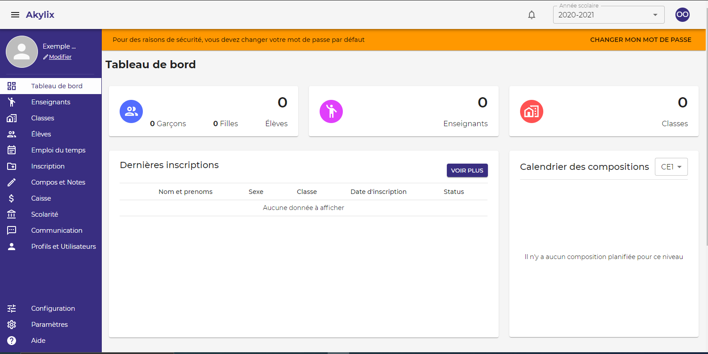
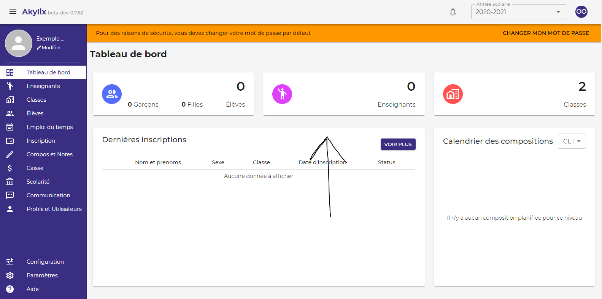
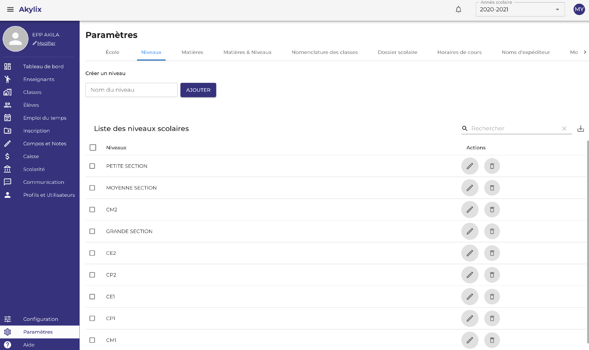
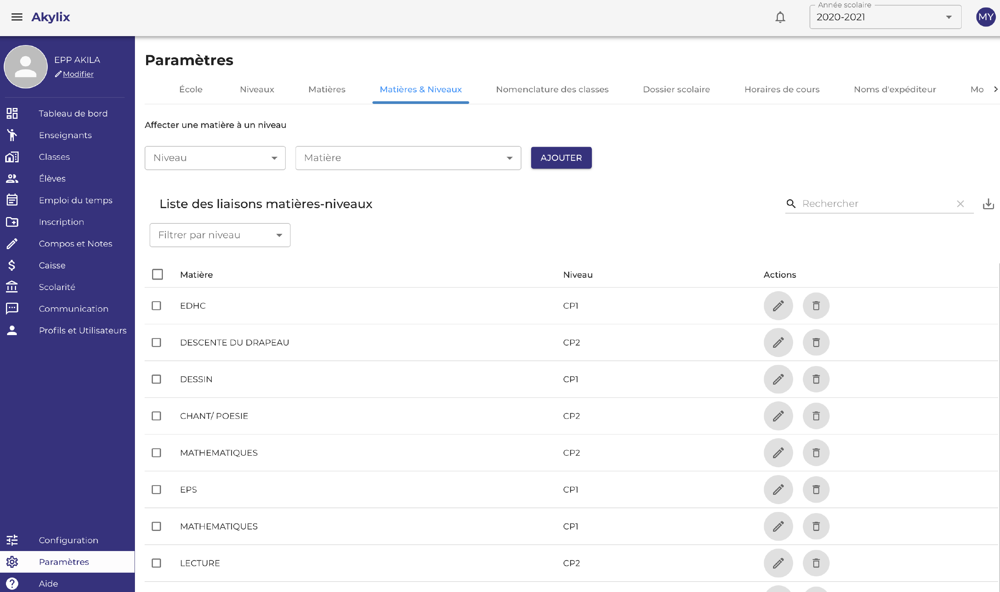
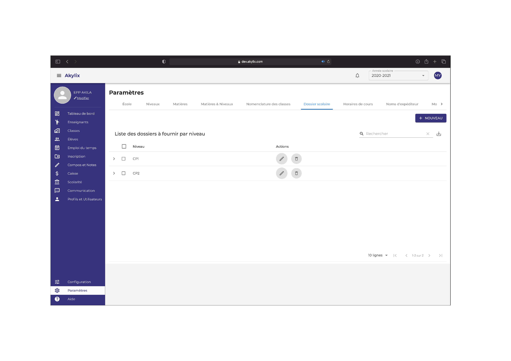
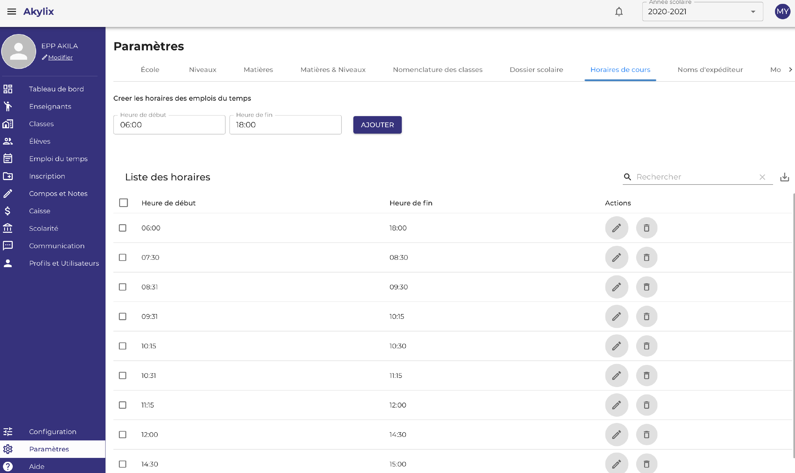
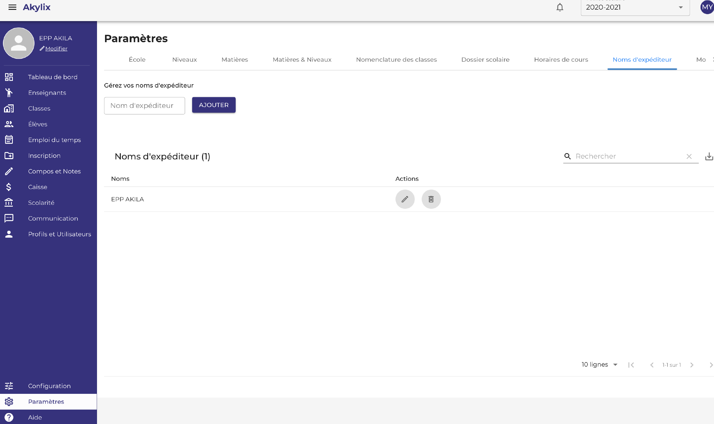
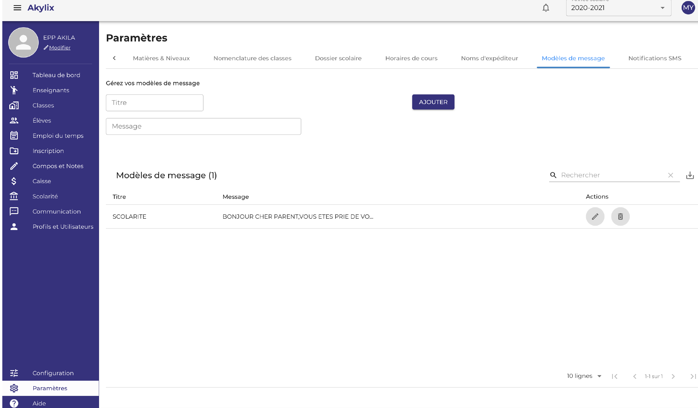
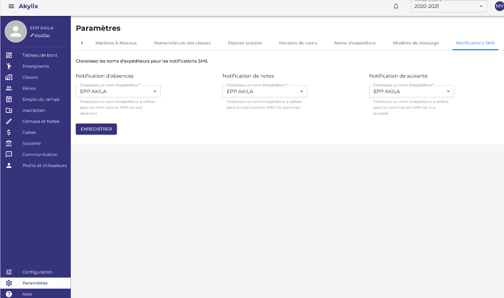

## Administrateur

L'**Administrateur** est la personne qui va administrer l'établisement il à tout les droits

### Connexion Administrateur

Utilisez les identifiants (adresse e-mail et mot de passe) de l'**administrateur** pour vous connectez 

le mot de passe par défaut est: 123456789

### Tableau de bord de l'Administrateur

## Présentation du tableau de bord de l'administarteur

Le tableau de bord est composé de trois parties principales:
- La Barre de navigation
- Le Menu de navigation
- La Zone de travail

### Barre de navigation

La barre de navigation se situe en haut de votre ecran elle contient :

- Un bouton qui va vous permettre de dérouler le menu de navigation, elle se situe à gauche de la barre de navigation
- Un champs Année scolaire pour sélectionner une année (l’année en cours sera l’année sélectionner par défaut)
- Un bouton qui va vous permettre de voir les sections **Mon profil**, **Mon compte** et **se déconnecter**. Ce bouton se trouve à droite de la barre de navigation.

### Menu de navigation

Le menu de navigation, qui est en bleue et se trouve à gauche de votre écran, il va vous permettre de naviguer entre les différents modules (sections) qu’offre Akylix

- Tableau de bord
- Classes
- Eleves
- Emploi du temps
- Inscription
- Compos et notes
- Caisse
- Scolarite
- Communication
- Configuration
- Parametres
- Aide

### Zone de travail

La zone de travail est la partie située au milieu de votre écran, elle va vous permettre de voir les informations sur un module sélectionné, et d’effectuer les actions sur ce module tel qu’afficher, ajouter, modifier, supprimer...

---

Le tableau de board de l'administarteur comprand 3 parties princiles qui sont la **Barre de navigation** qui se situe en haut de votre ecran, le **Menu de navigation** qui est en blue et se situe à gauche de votre ecran et la **Zone de travail** qui se situe au milieu de votre ecran.

## Parametrages

:::important

La première chose à faire est de paramétrer l’application (Les informations des paramètres sont des informations qui ne changent pas forcement chaque année

:::

Dans le menu de navigation à gauche, cliquez sur **Paramètres**, l'avant dernier menu

### Les informations sur l'école

La première tâche est la finalisation des informations sur l’école.  Lorsque cela est terminé, cliquez sur le bouton **Enregistrer**

### Les Niveaux

Pour aller sur l'onglet niveau cliquez sur **Niveau** dans la zone de travail

Les niveaux du primaire par défaut sont déjà définis affichés :  
Pour modifier cliquez sur l’icône **crayon** en face du niveau 
Pour supprimer cliquez sur l’icône de la **corbeille**  
Pour ajouter des niveaux : écrivez le nom du niveau dans le champ **Nom du Niveau** dans la zone de traval puis cliquez sur **Ajouter**

### Matière

IL S’AGIT ICI DE CRÉER UNE LISTE DE TOUTES LES MATIERES ENSEIGNEES DANS VOTRE ECOLE. 
Pour aller sur l'onglet matière cliquez sur **Matière** dans la zone de travail

Ecrivez le nom de la matière dans le champ **libelle de la matière** 
Générez une couleur à attribuer à la matière en cliquant sur le champ **générer une couleur** 
Cliquez ensuite sur le bouton **CREER LA MATIERE** pour l’ajouter ;  
Répétez l’action jusqu’à créez toutes les matières enseignées dans votre établissement.

### Matières et Niveaux

Pour aller sur l'onglet matières et niveaux cliquez sur **Matières et Niveaux** dans la zone de travail

Il s’agit ici de lier les matières créer au préalable aux niveaux également créer, c’est une liaison entre la matière enseignée et le niveau.

Toujoure dans la zone de travail cliquez dans le champ **Niveau** et sélectionnez un niveau *CP1 par Example* 
Cliquez dans le champ **Matière** sélectionnez une matière, ou cliquez sur toutes les matières que vous voulez lier au niveau que vous avez choisi 
Cliquer sur **Ajouter**  Répétez l’action jusqu’à lier des matières à tous les niveaux que vous avez créé.

### Dossiers Scolaire

Pour aller sur l'onglet Dossiers Scolaire cliquez sur **Dossiers Scolaire** dans la zone de travail

Toujours dans la zone de travail cliquez sur le bouton **NOUVEAU** en haut à droite

Ensuite cliquez sur **Selectionner un Niveau**

Ensuite ecrivez l’intitulé du dossier dans le champ **Libelle du Document**  
puis cliquez sur le bouton **+**  
Apres avoir fini de renseigner tous les dossiers cliquez sur le bouton **ENREGISTRER** 
Et faites ceci pour tout les Niveau.

### Horaire de Cours

**Il s’agit de créer des horaires de cours pour l’emploi du temps.**
:::note

UTILISER LA PLUS PETITE UNITE HORAIRE POUR FACILITER LA CREATION

:::

Renseignez une heure de début dans la zone **Heure de début** et une heure de fin dans la zone **Heure de fin** 
**Ex : 7h 30 - 8h 15** 
Cliquez sur **Ajouter** et répétez jusqu’à la fin.

### Nom d’expéditeur

**Nom d’expéditeur** . 
**Ex : EPP ORPHEE**
:::warning

Le nom d’expéditeur doit être constitué de 11 caractères donc vous pouvez abréger le nom de votre école s’il est long.

:::

Dans le champs **Nom d'expediteur**  renseignez le nom d'xpediteur **Ex : EPP ORPHEE**  
Ensuite cliquez sur le bouton **Ajouter**

### Modèle de message

Il s’agit de préenregistrer des modèles de messages 

Dans le champ **Titre** écrivez le titre du message  
**Ex : Mardi Gras** 
Dans le champ **Message** écrivez le contenu du message ensuite
Cliquez sur **Ajouter**

### Notifications SMS

Il s’agit de choisir un nom d’expéditeur pour l'envoie des SMS

Pour ce faire cliquez dans l'onglet **Choisissez un nom d’expéditeur** pour les envois des différentes notifications d’informations aux parents à savoir et cliquez sur le bouton **Enregistrer**

