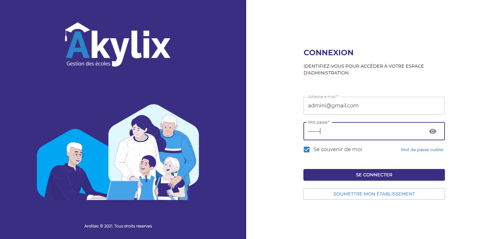

## Administrateur

L'**Administrateur** est la personne qui va administrer l'établisement, il a tout les droits

### Connexion Administrateur

Utilisez les identifiants (adresse e-mail et mot de passe) de l'**administrateur** pour vous connectez 

le mot de passe par défaut est: 123456789

### Tableau de bord de l'Administrateur

## Présentation du tableau de bord de l'administarteur

Le tableau de bord est composé de trois parties principales:
- La Barre de navigation
- Le Menu latéral
- La Zone de travail

### Barre de navigation

La barre de navigation se situe en haut de votre ecran elle contient :

- Un bouton qui va vous permettre de dérouler le Menu latéral, elle se situe à gauche de la barre de navigation
- Un champs Année scolaire pour sélectionner une année (l’année en cours sera l’année sélectionner par défaut)
- Un bouton qui va vous permettre de voir les sections **Mon profil**, **Mon compte** et **se déconnecter**. Ce bouton se trouve à droite de la barre de navigation.

### Menu latéral

Le Menu latéral, qui est en bleue et se trouve à gauche de votre écran, il va vous permettre de naviguer entre les différents modules (sections) qu’offre Akylix

- Tableau de bord
- Classes
- Eleves
- Emploi du temps
- Inscription
- Compos et notes
- Caisse
- Scolarite
- Communication
- Configuration
- Parametres
- Aide

### Zone de travail

La zone de travail est la partie située au milieu de votre écran, elle va vous permettre de voir les informations sur un module sélectionné, et d’effectuer les actions sur ce module tel qu’afficher, ajouter, modifier, supprimer...

---
