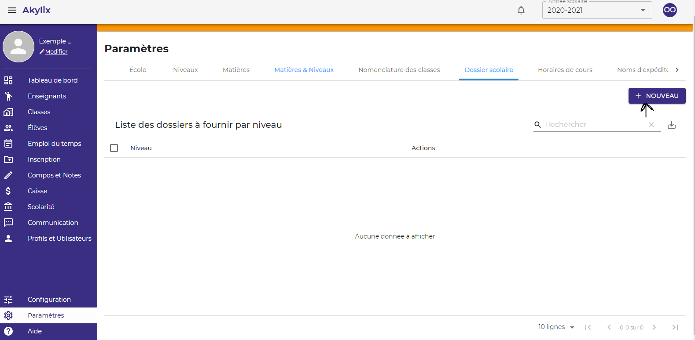
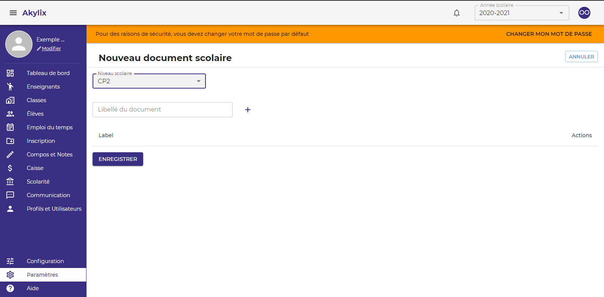

## Administrateur

L'**Administrateur** est la personne qui va administrer l'établisement il à tout les droits

## Connection 

Utiliser les identifiants de l'administrateur pour vous connectez 

le mot de passe par défaut est: 123456789

## Tableau de bord de l'Administrateur

## Parametrages

:::important

La première chose à faire et de paramétrer l’application (Les informations des paramètres sont des informations qui ne changent pas forcement chaque année

:::

Dans la barre de menu à gauche, aller cliquer sur **Paramètres**, avant dernier menu

### Les informations sur l'école

La première tâche est la finalisation des informations sur l’école; lorsque cela est terminé, cliquer sur le bouton **Enregistrer**

### Les Niveaux

Les niveaux du primaire par défaut sont affichés :
Pour modifier cliquer sur l’icône **crayon** en face du niveau
Pour supprimer cliquer sur l’icône de la **corbeille**
Pour ajouter des niveaux : écrire le nom du niveau dans le champ prévu à cet effet puis cliquer sur **Ajouter**

### Matière

IL S’AGIT ICI DE CRÉER UNE LISTE DE TOUTES LES MATIERES ENSEIGNEES DANS VOTRE ECOLE.

Ecrire le nom de la matière dans le champ **libelle de la matière** 
Générer une couleur à attribuer à la matière en cliquant sur le champ **générer une couleur** 
Cliquer ensuite sur **créer la matière** pour l’ajouter ;  Répéter l’action jusqu’à créer toutes les matières enseignées dans votre établissement

### Matières et Niveaux

<!-- 

 -->
IL S’AGIT ICI DE LIER LES MATIERES CREEES AU PREALABLE AU IVEAUX CREES EGALEMENT

Cliquer dans le champ **niveau** et sélectionner un niveau 
Cliquer dans sélectionner matières et cliquer sur toutes les matières que vous voulez lier au niveau que vous avez choisi 
Cliquer sur **Ajouter** et répéter l’action jusqu’à lier des matières à tous les niveaux que vous avez créé.

### Dossiers Scolaire

Cliquer sur **Nouveau** en haut à droite

Ensuite cliquer sur **Selectionner un Niveau**

Ensuite ecrire l’intitulé du dossier dans le champ **Libelle du Document**

Ensuite cliquer sur le **+**

Repeter l’action jusqu’à créer la liste de tous les dossiers à fournir pour le niveau et
Cliquer sur **Enregistrer** refaire la même action pour tous les niveaux.

### Horaire de Cours

**Il s’agit de créer des horaires de cours pour l’emploi du temps.**

:::note

UTILISER LA PLUS PETITE UNITE HORAIRE POUR FACILITER LA CREATION

:::

Renseigner une heure de début dans la zone **Heure de début** et une heure de fin dans la zone **Heure de fin** 
**Ex : 7h 30 - 8h 15** 
Cliquer sur **Ajouter** et répéter jusqu’à la fin.

### Nom d’expéditeur

**Nom d’expéditeur** est le nom qui va apparaitre lorsque les parents recevront des sms de l’école. 
**Ex : EPP ORPHEE**
:::warning

Le nom d’expéditeur doit être constitué de 11 caractères donc vous pouvez abréger le nom de votre école s’il est long.

:::

### Modèle de message

Il s’agit de préenregistrer des modèles de messages 

<!--  -->

Dans le champ **Titre** écrire le titre du message  
**Ex : mardi gras** 
Dans le champ **Message** écrire le contenu du message 
Cliquer sur **Ajouter**

### Notifications SMS

Il s’agit de choisir un nom d’expéditeur dans l'onglet **Choisissez un nom d’expéditeur** pour les envois des différentes notifications d’informations aux parents à savoir et cliquer sur le bouton **Enregistrer**

