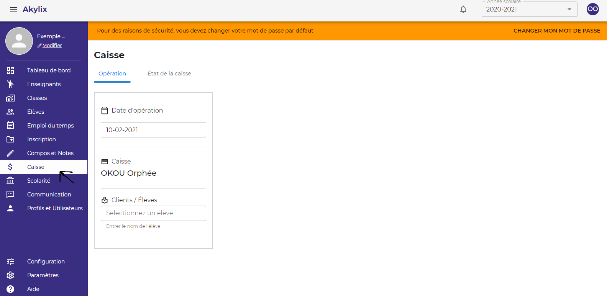
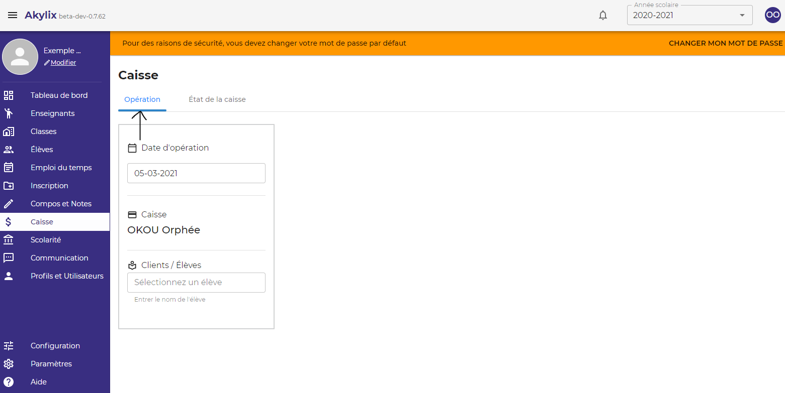
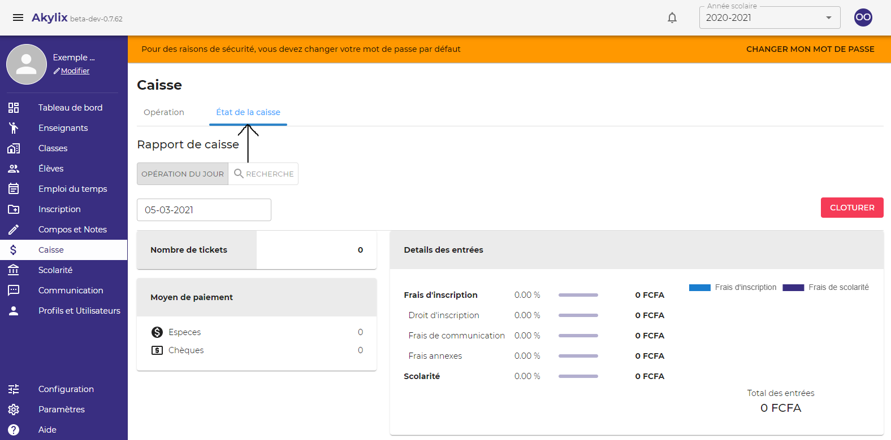

## Caisse

Pour allez sur la caisse, cliquez sur le module **Caisse** dans le menu de navigation en bleu à gauche de votre ecran

### Opération

Cette partie ne concerne que les opérations d’entrée en caisse.

### Etat de la caisse

Il s’agit ici de vérifier les actions effectuées à la caisse et de clôturer la journée lorsqu’on a fini de travailler.
Vous pouvez également effectuer un suivi de caisse en sélectionnant le caissier pour lequel vous voulez effectuer le suivi

### Cloturer la caisse

