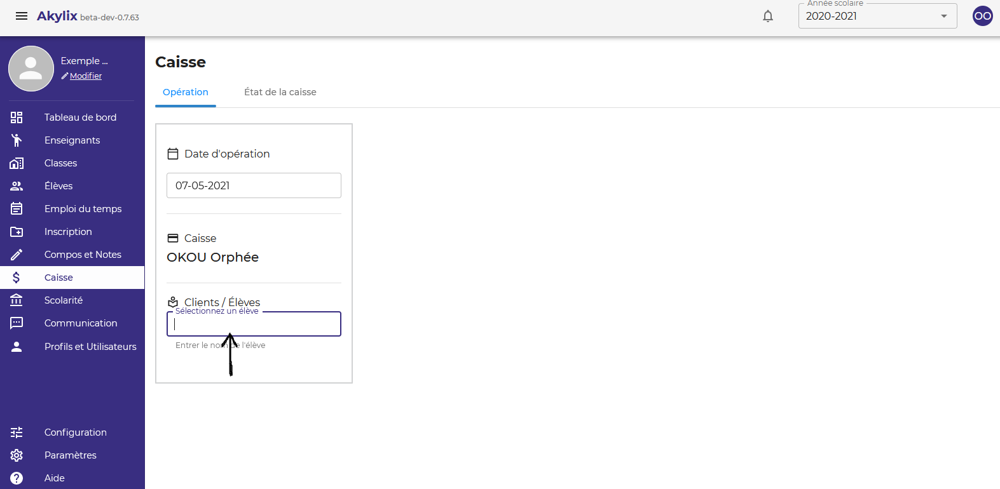
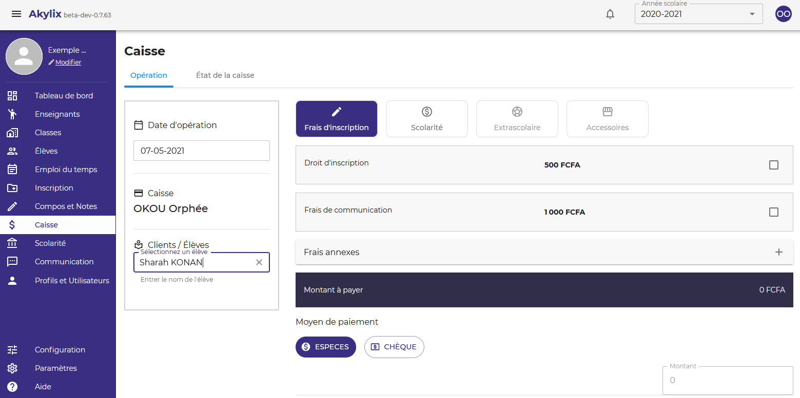
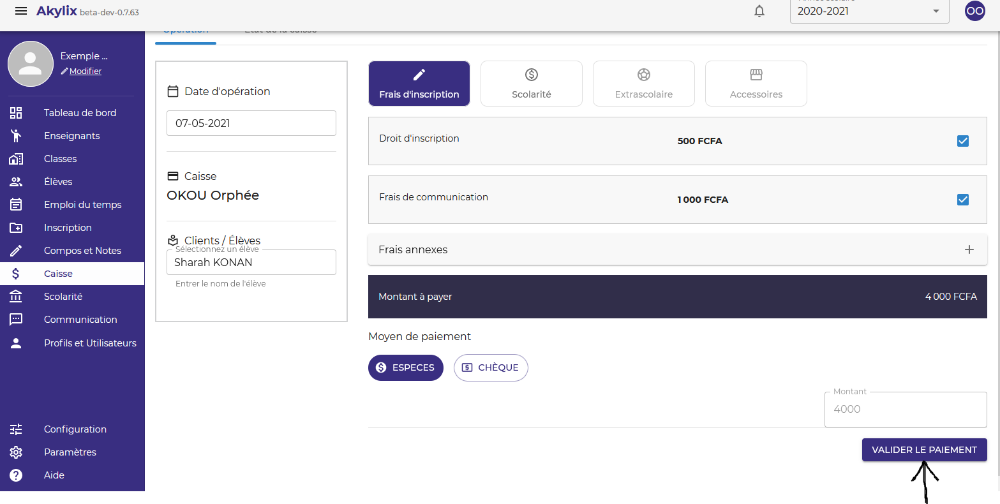
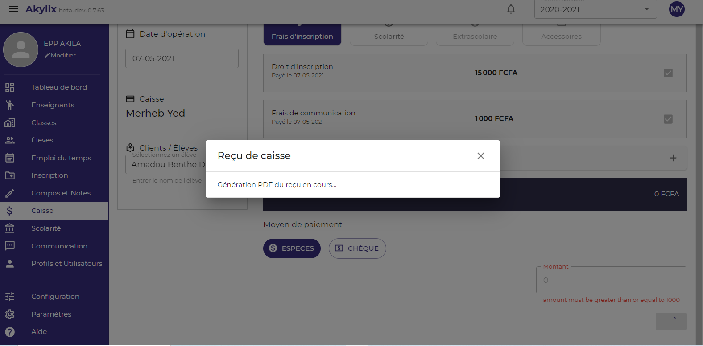
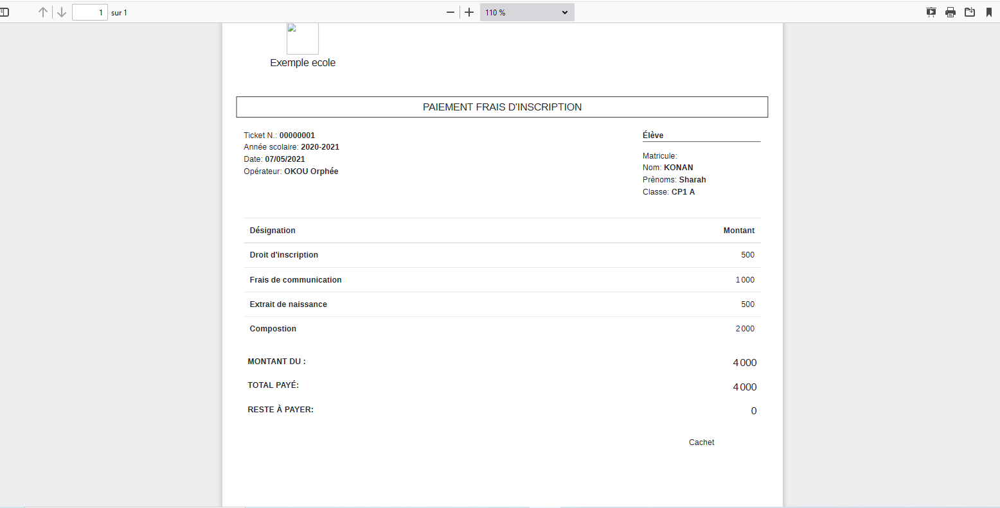
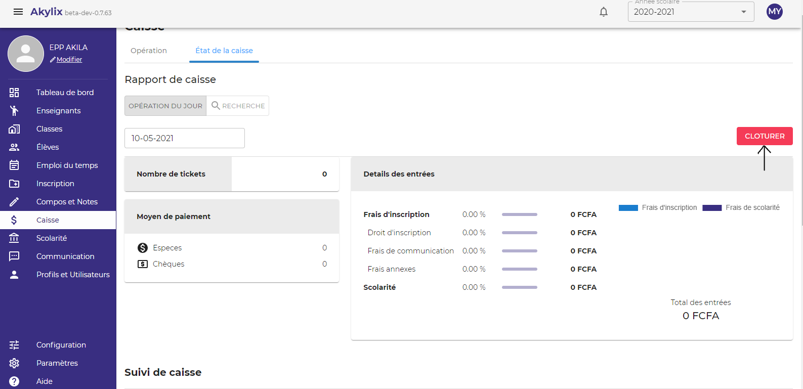

## Caisse

Pour allez sur la caisse, cliquez sur le module **Caisse** dans le Menu latéral en bleu à gauche de votre ecran

### Opération

Cette partie ne concerne que les opérations d’entrée en caisse.

Pour effectuer le paiement d’un élève veillez renseigner le nom de l’élève dans le champ **Sélectionnez un élève**

Quand vous aller commencer à saisir le nom de l’élève,  la liste des élèves portant le même nom vont s’afficher, veuillez sélectionner le bon nom, une fois que l’élève est sélectionné les frais qu’il doit vont s’afficher.

Cocher tous les frais qu’il a payé et cliquez sur le buton **VALIDER LE PAIEMENT**

Apres quelques secondes le reçu sera générer et accessible dans votre dossier de téléchargement.

Vous pouvez l'ouvrir

### Etat de la caisse

Il s’agit ici de vérifier les actions effectuées à la caisse et de clôturer la journée lorsqu’on a fini de travailler.

Vous pouvez également effectuer un suivi de caisse en sélectionnant le caissier pour lequel vous voulez effectuer le suivi

### Cloturer la caisse

Une fois que vous avez finis les opérations de la caisse pour une journée, vous devez clôturer la journée en cliquant sur le bouton **CLOTURER**

