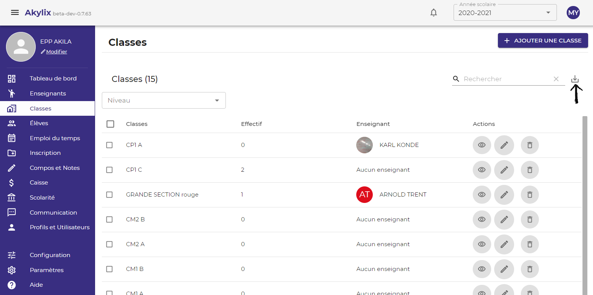

## Classes

Il s’agit ici de créer des classes et de les attribuer un enseignant déja crée dans la partie ***Enseignant***.

Pour cela cliquez sur **Classes** dans le Menu latéral bleu à gauche à gauche de votre ecran

Cliquez sur le bouton **Ajouter une classe** dans la zone de travail

Sélectionnez un niveau, en cliquant sur **Niveau**

Renseigner le nom de la classe dans l'onglet **Nom de la classe**

Ajoutez un enseignant en cliquant sur l'onglet **Enseignat** , ***(Cette action est facultative)***, ensuite cliquez sur le bouton **valider**

Et répétez l’action jusqu’à créer toutes les classes pour votre école.

### Importation

On peut importer la liste des classes sous forme de fichier excel en cliquant sur l'icône d'impression (voir flèche sur l'image)

Une fois que vous cliquez sur l'cône d'importation, la liste des classes sera téléchargée et accessible dans votre dossier de téléchargement.