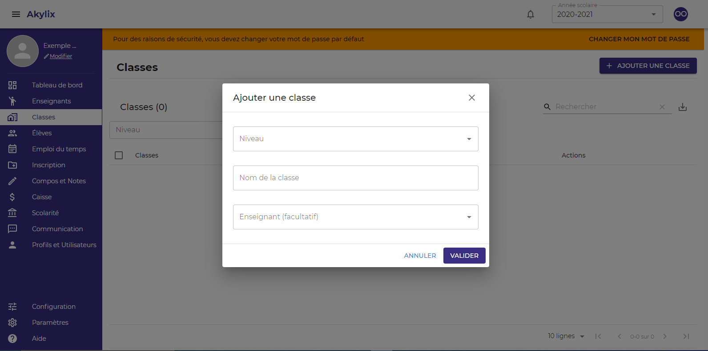

## Classes

Il s’agit ici de créer des classes et de les attribuer un enseignant qu’on a préalablement crée dans la partie ***Enseignant***.  
Pour cela cliquez sur **Classes** dans le menu de navigation bleu à gauche

Cliquez sur le bouton **Ajouter une classe** dans la zone de travail

Sélectionnez un niveau, en cliquaant sur **Niveau**
Ecririvez le nom de la classe dans l'onglet **Nom de la classe**
Ajoutez un enseignant en cliquant sur l'onglet **Enseignat** , ***Cette action est facultative***  
Ensuite Cliquez sur **valider**  
Et répétez l’action jusqu’à créer toutes les classes pour votre  école

