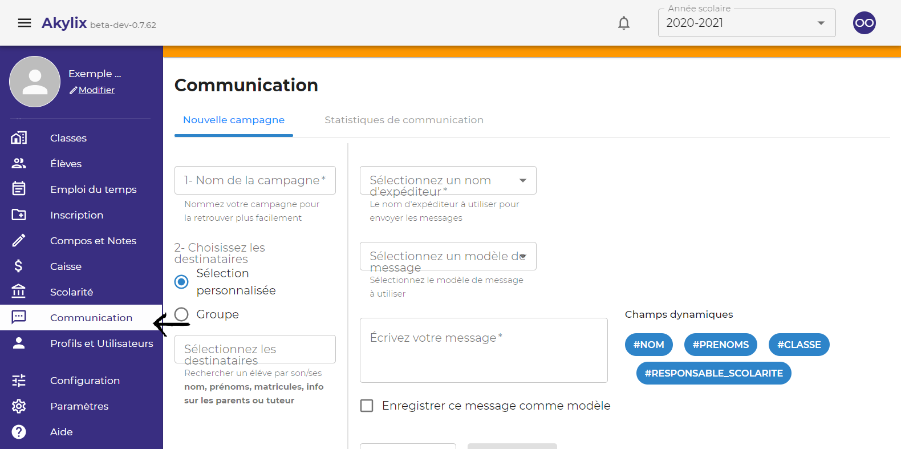
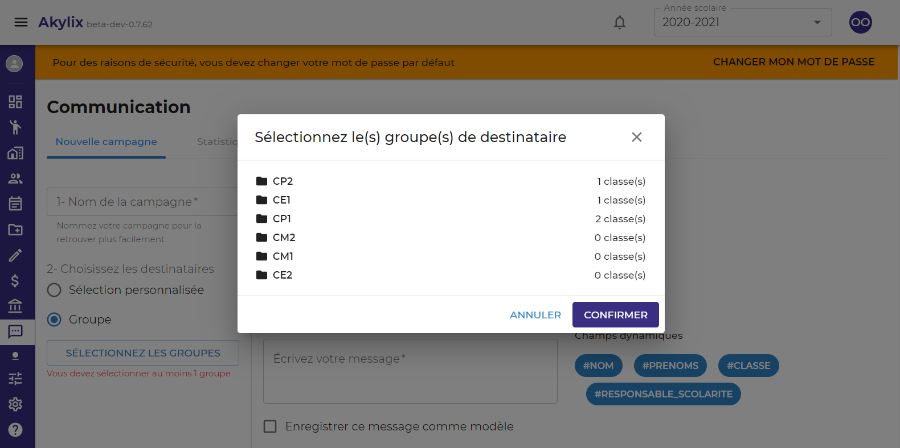
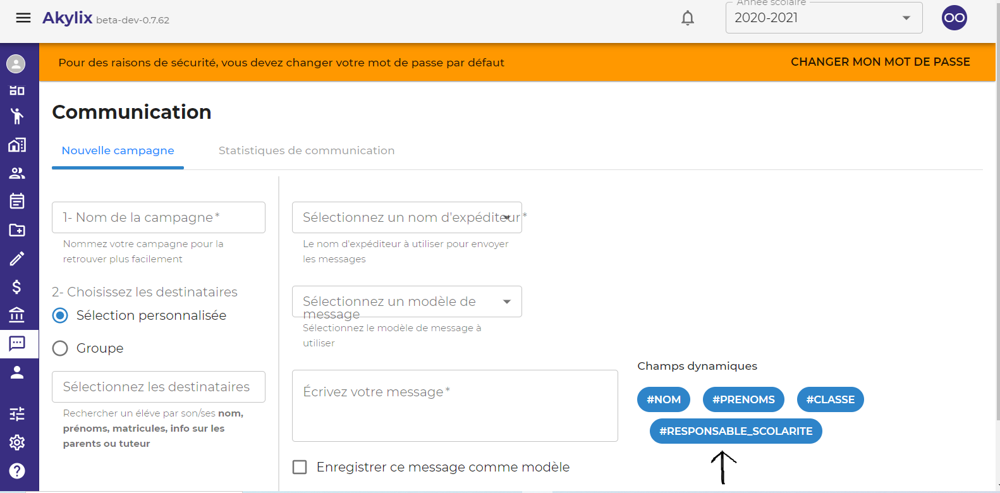
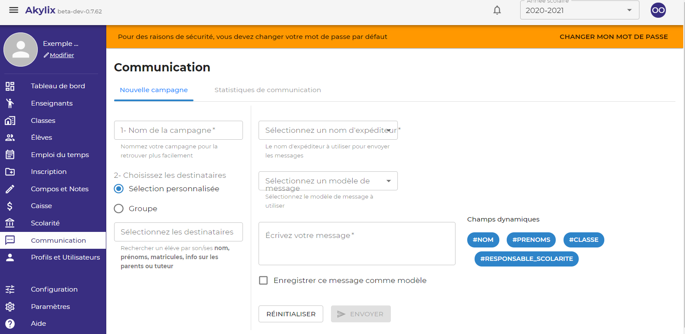

## Communication

Pour aller sur le module de communication cliquez sur **Communication** dans le menu de navigation bleu à gauche.

Le module de communication comprend 2 parties  
**Nouvelle campagne** et **Satistiques de communication**

### Nouvelle campagne (Pour le cas d'envoi a un group de contact)

#### 1 - Cas d’un envoi de messages simple à un groupe de contacts (classes ou niveaux)

Renseigner le **Nouvelle campagne** dans la zone de travail

Cliquez sur **Group** dans la zone de travail ensuite cliquez sur le button **SELECTIONNER LES GROUPES**

Ensuite sélectionnez le groupe sur la boite de dialoge qui s'affiche (ce groupe peut être un niveau ou une classe). 
Puis cliquez sur le button **Confirmer**.

Sélectionnez un nom d’Expéditeur en cliquant sur le champs **Sélectionnez un nom d’Expéditeur** dans la zone de travail, (lorsque vous cliquez sur ***sélectionnez un nom d’expéditeur***, la liste de vos noms d’expéditeurs s’affichera, cliquez sur celui que vous souhaitez utiliser pour la présente campagne).

Sélectionnez un modèle de message en cliquant dans le champs **Sélectionnez un modèle de message** si vous en avez un que vous souhaitez utiliser / ou écrivez directement le message dans le champ prévu à cet effet.

Vous pouvez enregistrer le message écrit comme modèle en cliquant dans la case **ENREGISTRER CE MESSAGE COMME MODELE**

Lorsque vous avez renseigné tout les champs, le bouton **ENVOYER** change de couleur et devient bleu. 

Cliquez sur **ENVOYER** pour effectuer votre campagne sms.

#### 2 - Cas d’un envoi de messages personnalisés aux parents d’élèves

Dans la zone de travail se trouve une partie **Champs dynamiques** qui contient des champs qui vont vous permettre de personnaliser les messages, qui sont: **NOM**, **PRENOMS**, **CLASSE**, **RESPONSABLE DE LA SCOLARITE**.

LORSQUE VOUS LES SURVOLEZ ? VOUS VOYEZ A QUOI ILS CORRESPONDENT.

Suivez les mêmes étapes que pour l'envoie d'un message simple (voir 1)

Puis lors de la rédaction de votre message insérez les champs dynamiques selon la manière dont vous voulez personnaliser votre message.

Vous pouvez enregistrer votre message comme modèle et l’envoyer.

:::note

#### EXEMPLE DE MESSAGE AVEC DES CHAMPS DYNAMIQUES 

BONJOUR #RESPONSABLE DE LA SCOLARITE, VOTRE ENFANT #NOM #PRENOMS EN #CLASSE EST PRIE DE SE PRESENTER AVEC VOUS A LA JOURNEE PORTES OUVERTES DU 10 JUIN 2021

***CE MESSAGE AVEC DES CHAMPS DYNAMIQUES EQUIVAUT EN REALITE A ***

BONJOUR NOM DU PÈRE, DE LA MERE OU DU TUTEUR DE CHAQUE ENFANT DU GROUPE SELECTIONNE, VOTRE ENFANT (NOMS ET PRENOMS DE CHAQUE ENFANT DU GROUPE SELECTIONNE) EN (CHAQUE CLASSE DU NIVEAU SELECTIONNE) EST PRIE DE SE PRESENTER AVEC VOUS A LA JOURNEE PORTES OUVERTES DU 10 JUIN 2021.

*** DONC EN GROS ON AURA COMME MESSAGE :***

BONJOUR MR KONE, VOTRE ENFANT KONE SEKOU EN CM2B EST PRIE DE SE PRESENTER AVEC VOUS A LA JOURNEE PORTES OUVERTES DU 10 JUIN 2021

:::

### Nouvelle campagne (Pour le cas d'envoi Personnalisés)

IL S’AGIT ICI D’ENVOYER UN SMS A UN OU QUELQUES ELEVES DE VOTRE ECOLE

Renseigner le nom de votre campagne dans le champs **Nouvelle campagne** 

Cliquez sur **SELECTION PERSONNALISÉE** pour choisir les destinataires

Dans le champ **Sélectionner les destinataires** écrivez les noms des élèves pour lesquels vous voulez envoyer des messages aux parents

Sélectionnez un nom d’expéditeurs dans le champs **Sélectionnez un nom d’Expéditeur**

Sélectionnez un modèle de message ou écrivez votre message en cliquant dans le champs **Sélectionnez un modèle de message**

Enregistrez et envoyez le message.

### Satistiques de communication

(Nous y reviendrons)
