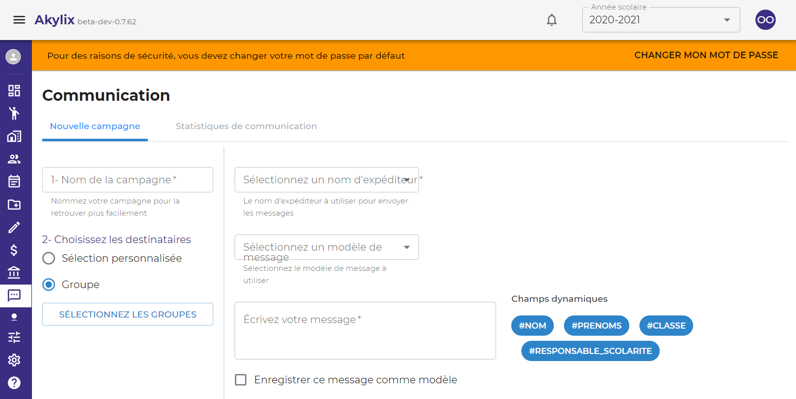

## Communication

Pour aller sur le module de communication cliquez sur **Communication** dans le menu de navigation bleu à gauche. comm1.PNG

Le module de communication comprend 2 parties  
**Nouvelle campagne** et **Satistiques de communication**

### Nouvelle campagne

- Cas d’un envoi de messages simple à un groupe de contacts (classes ou niveaux)

Renseigner le **Nouvelle campagne** dans la zone de travail 

Cliquez sur **Group** dans la zone de travail ensuite cliquez sur le button **SELECTIONNER LES GROUPES**

Ensuite sélectionnez le groupe sur la boite de dialoge qui s'affiche (ce groupe peut être un niveau ou une classe). 
Puis cliquez sur le button **Confirmer**.

Sélectionnez un nom d’Expéditeur en cliquant sur le champs **Sélectionnez un nom d’Expéditeur** dans la zone de travail, (lorsque vous cliquez sur ***sélectionnez un nom d’expéditeur***, la liste de vos noms d’expéditeurs s’affichera, cliquez sur celui que vous souhaitez utiliser pour la présente campagne).

Sélectionnez un modèle de message si vous en avez un que vous souhaitez utiliser / ou écrivez directement le message dans le champ prévu à cet effet.

Vous pouvez enregistrer le message écrit comme modèle en cliquant dans la case **ENREGISTRER CE MESSAGE COMME MODELE**

Lorsque vous avez renseigné tout les champs, le bouton **ENVOYER** change de couleur et devient bleu. 

Cliquez sur **ENVOYER** pour effectuer votre campagne sms.
