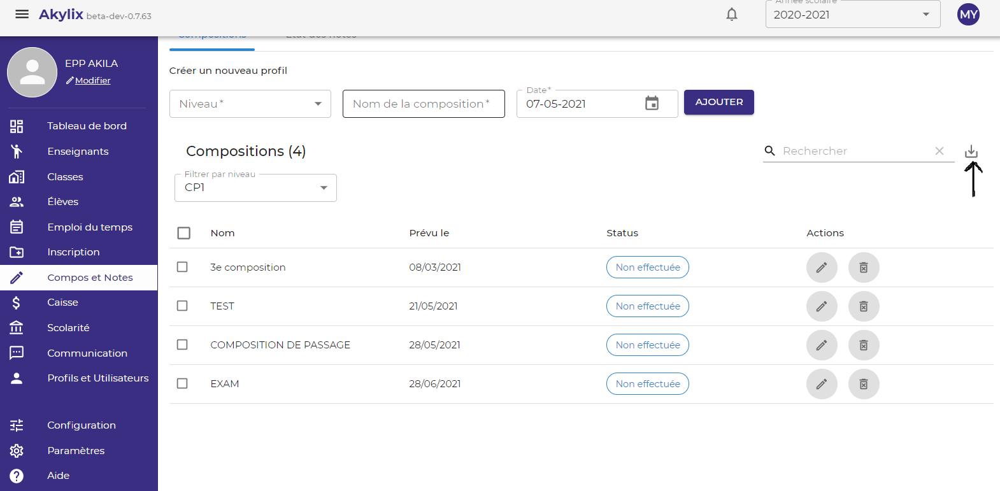

## Compositions et notes

Il s'agit dans ce module de définir les compositions et de voir l'état des notes.

Pour ce faire aller sur compositions et notes en cliquant sur **Compos et notes** dans le menu de navigation bleu à gauche de votre ecran.

### Compositions

Ici il s'agit de définir les compositions

Sélectionnez un niveau en cliquant dans l'onglet **Niveau** dans la zone de travail.

Renseignez le nom de la composition dans **Nom de la composition**

Puis la date de tenue dans **Date** ensuite cliquez sur le bouton **Ajouter**.

Vous pouvez filtrer les compositions par niveau en cliquant sur **Filtrer par Niveau** et choisissez le niveau ou la classe.

Une fois que la classe est sélectionné, la liste des compositions va s'afficher s'il en existe.

Vous pouvez imprimer la liste des compositions dans un fichier Excel, en cliquant sur l'icône d'importation (voir flèche sur l'image)

Vous pouvez modifier une composition en cliquant sur l'icône du crayon ou supprimer une composition en cliquant sur l'icône de la corbeille.

### Etat de note

Pour accéder à l’état des notes cliquez sur **Etat des Notes**

Sélectionner une classe en cliquant sur **Classe** (flèche 1) dans la zone de travail,
Puis la composition pour laquelle vous voulez avoir les états en cliquant sur **Composition** (flèche 2).

 
Vous pouvez générer les états sous forme de documents PDF afin de les imprimer en cliquant sur **IMPRIMER** en haut à droite
