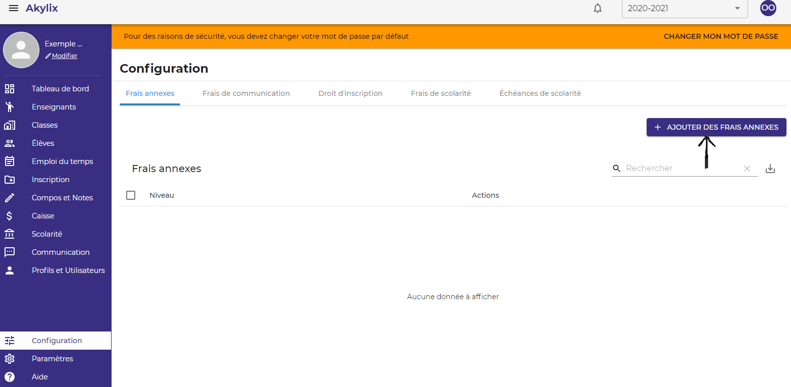
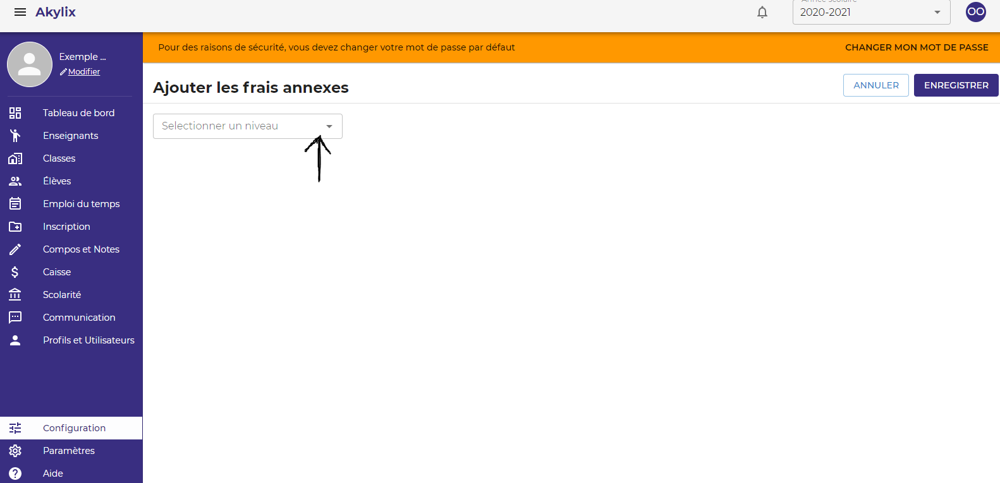
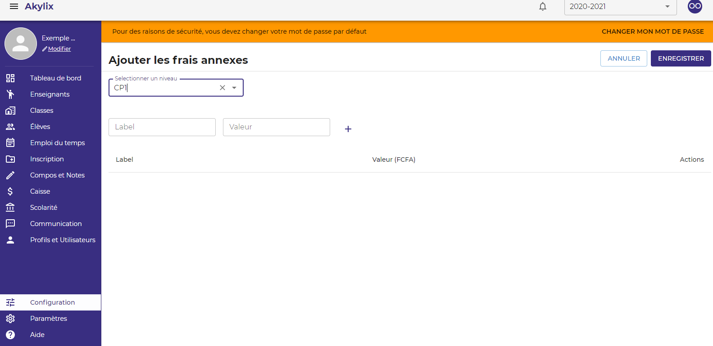
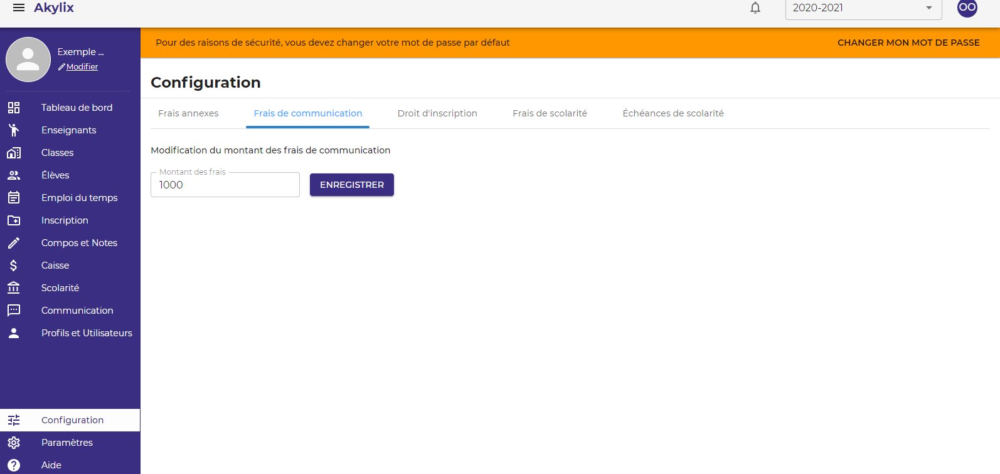
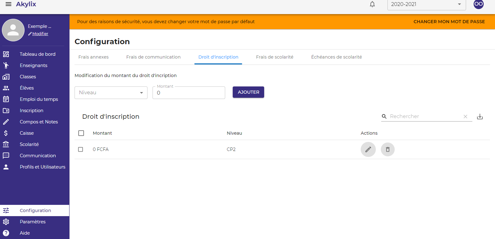
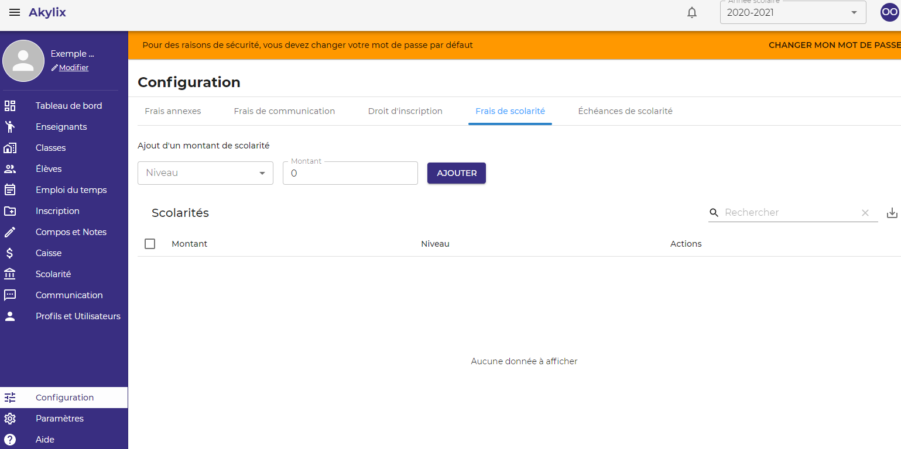
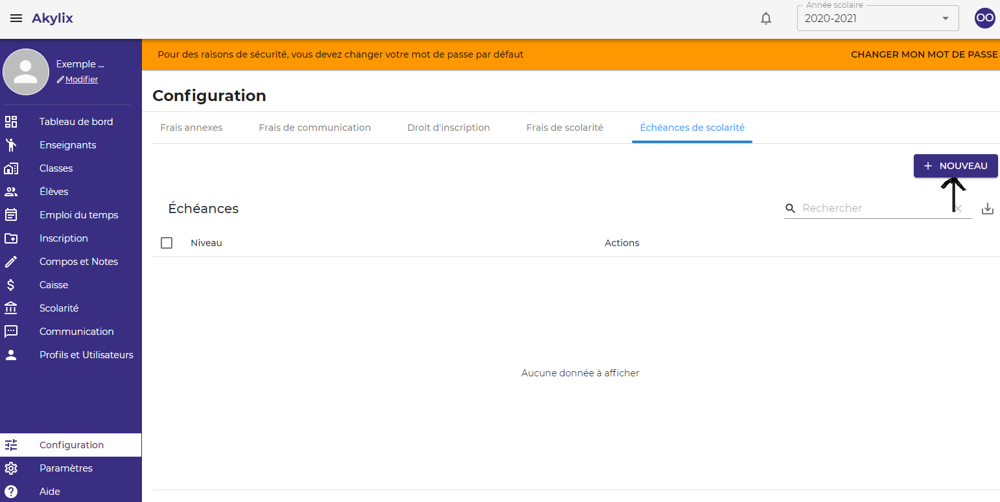
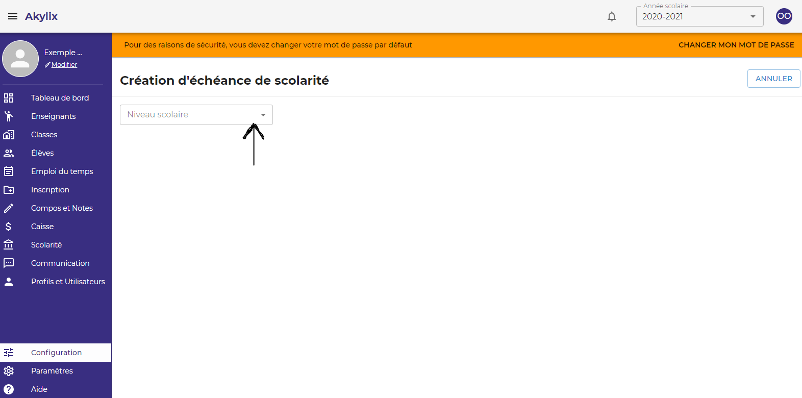
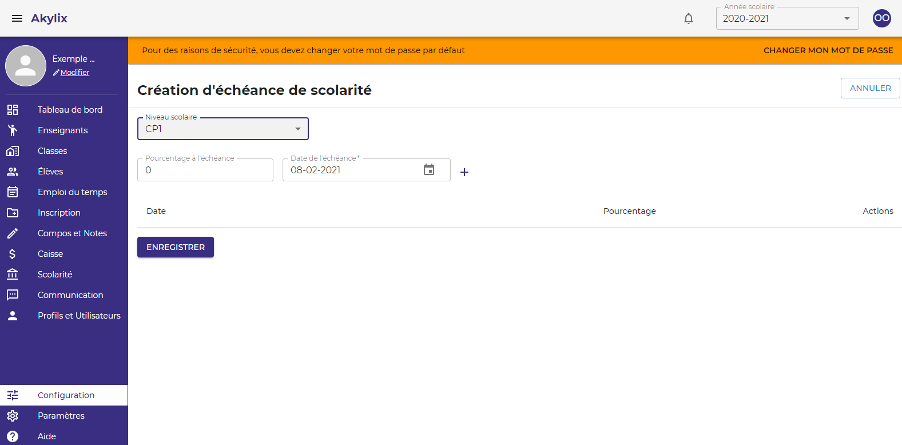

## Configuration

Pour aller sur **Configuration**  cliquez sur **Configuration** sur le menu de navigation en bleue à gauche de votre ecran.

### Frais annexes

Il s'agit ici de renseigner tous les frais d'annexe 
Pour ce faire, cliquez sur **AJOUTER DES FRAIS D'ANNEXES**

Ensuite cliquez sur **Sélectionner un niveau** et sélectionnez le niveau **CP1 par exemple**

Dans le champ **Label** écriver l’intitulé du frais 
Dans le champ **Valeur** le montant 
Cliquez sur l’icône **+** pour l’ajouter, et répétez l’action jusqu’à constituer l’entièreté des frais annexes pour ce niveau  
Apres avoir fini de renseigner les frais annexxe cliquez sur le bouton **ENREGISTRER** en haut à droite de votre ecran.

Refaire la même action pour les autres niveaux.

### Frais de communication

Les frais de communication s’élèvent à **1000f** par défaut  
Cliquez donc sur **Enregistrer**

### Droit d'inscription 

Il s'agit de renseigner les droits d'inscription pour chaque niveau, aller sur **Droit d'inscription** dans la zone de travail

Sélectionnez un niveau en Cliquant sur **Niveau**  
Renseignez le **Montant** du droit d’inscription pour ce niveau et cliquez sur **Ajouter**

Répéter l’action pour les autres niveaux

### Frais de Scolarités

Il s'agit de renseigner les frais de scolarité pour chaque niveau, pour cela aller sur **Frais de scolarité** dans la zone de travail

Sélectionnez un niveau en Cliquant sur **Niveau**  
Ecrivez le montant de la scolarité sur **Montant** puis cliquez sur **Ajouter**

### Échéances de Scolarités

Il s'agit de renseigner les Échéances de Scolarités, allez sur **Échéances de Scolarités** dans la zone de travail

Cliquez sur le bouton **Nouveau** en haut à droite

Sélectionnez un niveau en cliquant sur **Niveau scolaire**, ***CP1 par exemple***

Renseignez un pourcentage du montant de scolaritén dans **Pourcentage à l'échéance**  
Renseignez la date d’échéance du pourcentage défini dans **Date de l'échéance**  
Cliquez sur le bouton **Enregistrer**

Répéter l’action pour les autres niveaux

