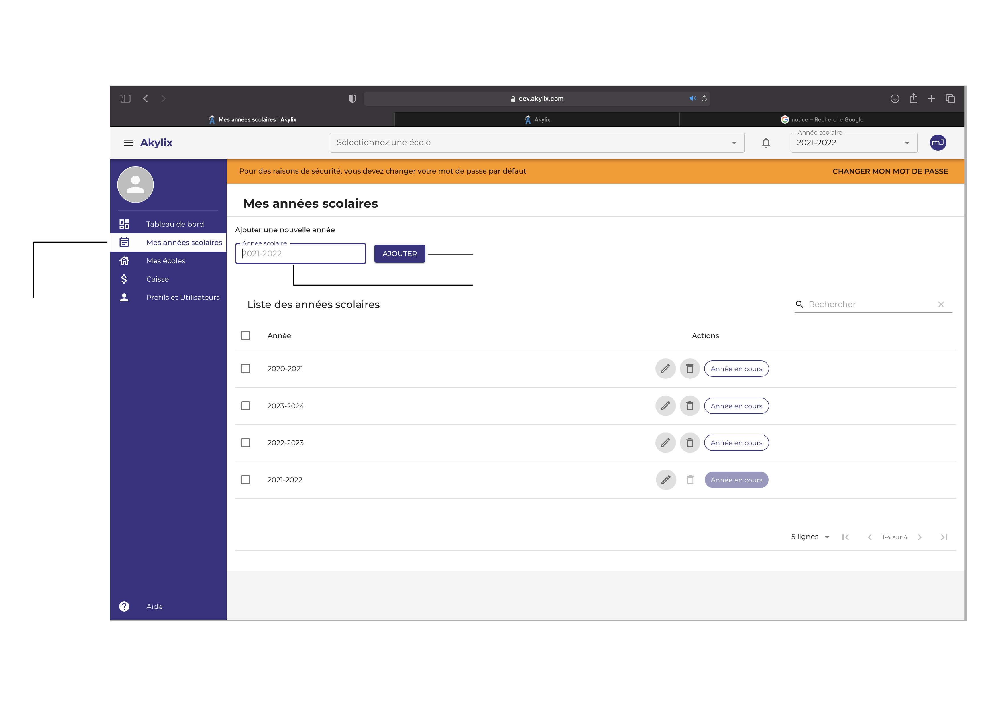
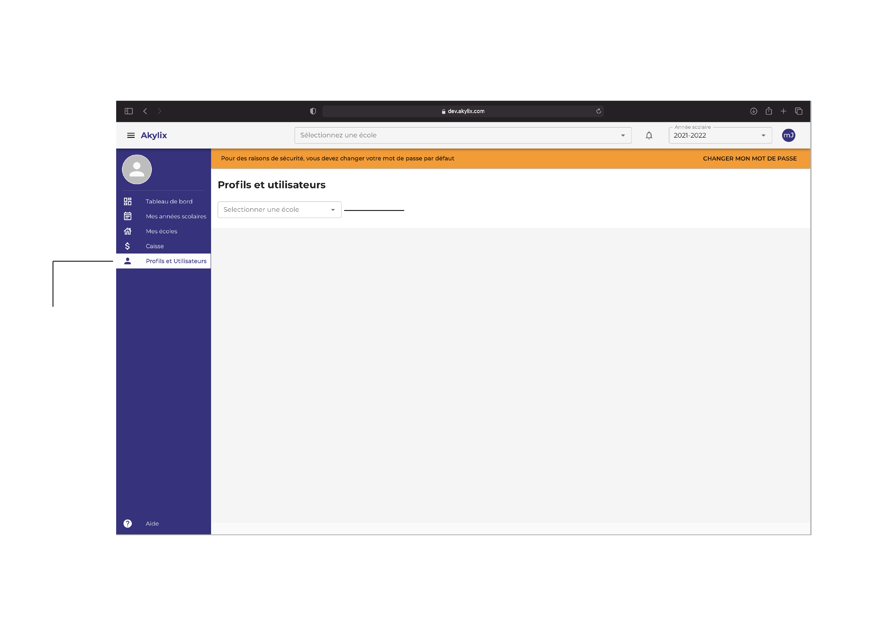

### Connexion

Apres soumission de votre établissement vous vous retrouvez sur la même page de départ,ou allez sur la page de  [connexion](https://app.akylix.com/login), puis renseignez l’adresse e-mail utilisé pour le **superviseur** lors de la soumission de votre établissement. Le mot de passe par défaut est : 123456789

Puis cliquez sur le boutton **SE CONNECTER**, vous serez rediriger sur une nouvelle page qui est le tableau de bord (Dashboard) du superviseur

### Présentation du tableau de bord

### Bare de navigation

### Bare de navigation

### Zone de travail

---

### Superviseur

Le superviseur est celui qui gère un ou plusieurs établissements scolaires et en a une vue Globale.

Pour dérouler le menu de navigation à gauche de votre écran, cliquez sur les trois traits dans la bare de navigation à côté d'Akylix en haut à gauche de votre écran.

---

### Création d’année scolaire

Pour définir les années scolaires cliquez sur **Mes années scolaires**

Cliquez sur la zone **Année scolaires** saisissez l'année sous le format suivant **2020-2021** puis cliquez sur le bouton **Ajouter**

### Profils et utilisateurs

Pour définir les Profils et utilisateurs cliquez sur **Profils et utilisateurs** puis sélectionnez votre école grâce à l'onglet **Sélectionner une école**.

Ensuite cliquez sur **Utilisateurs**

Une fois ici vous allez renseigner le **Nom**, l'**Adresse e-mail** et pour le profil sélectionnez **Administrateur** ensuite cliquez sur le bouton **Ajouter**

:::note

L'adresse e-mail fournit ici sera l'identifiant de l'Administrateur, veuillez utiliser une adresse différente de celle du superviseur.

:::

## Déconnection
Pour vous déconnectez cliquez dans les initiales en haut à droite dans le cercle bleu et cliquez sur **Se déconnecter**

---