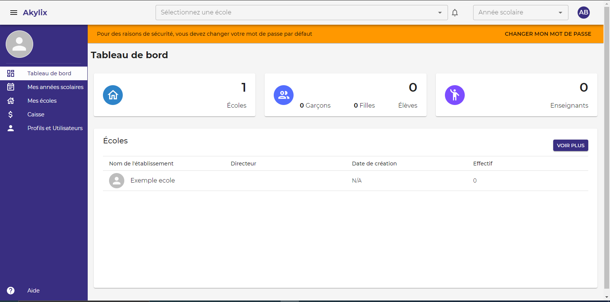

### Connection

Apres soumission de votre établissement vous vous retrouvez sur la même page de départ, cette fois y renseigner l’adresse e-mail utilisé pour le **superviseur** lors de la soumission de votre établissement et le mot de passe par défaut est: 123456789.

Puis cliquez sur le boutton **SE CONNECTER**, vous atterrissez sur une nouvelle page qui est le Dashboard (tableau de bord) du superviseur

---

### Superviseur

Le superviseur est celui qui gère un ou plusieurs établissements scolaire et en à une vue Globale.

Pour afficher les noms cliquez sur les trois traits à cote d'Akylix en haut à gauche de votre écran

### Création d’année scolaire

Pour définir les années scolaires veuiller cliquez sur **Mes années scolaires**

Cliquez sur la zone **Année scolaires** saisisser l'année sous le format suivant **2020-2021** puis cliquez sur le bouton **Ajouter**

### Profils et utilisateurs

Pour définir Profils et utilisateurs cliquez sur **Profils et utilisateurs** puis selectionnez votre ecole grâce à l'onglet **Selectinner une école**

une fois ici cliquez sur **Utilisateurs**

Une fois ici vous allez renseignez le **Nom**,  l'**Adresse e-mail** et pour le profil selectinner  **Administrateur** ensuite cliquez sur le bouton **Ajouter**

:::note

L'adresse e-mail fournit ici sera l'identifiant de l'Administrateur, veuillez utiliser une adresse differente de celle du superviseur.

:::

## Déconnection
Pour vous déconnectez cliquez dans les initiales en haut à droite dans le cercle bleu et cliquer sur **Se déconnecter**

---