## Connexion

Apres soumission de votre établissement vous serez rediriger sur la page de connexion, ou allez sur la page de [connexion](https://app.akylix.com/login), puis renseignez l’adresse e-mail utilisé pour le **superviseur** lors de la soumission de votre établissement. Le mot de passe par défaut est : 123456789

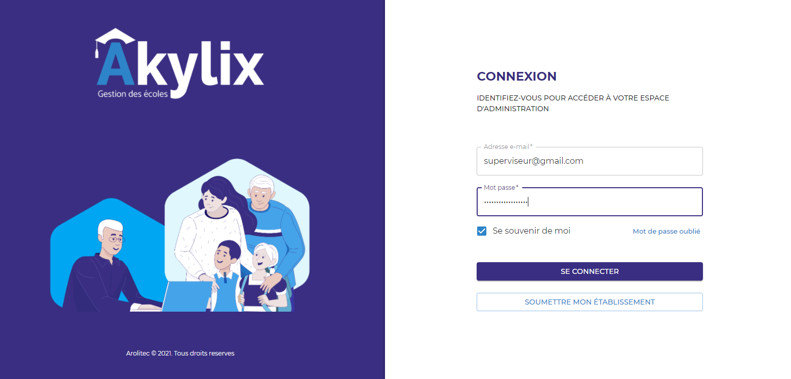

Puis cliquez sur le boutton **SE CONNECTER**, vous serez rediriger sur une nouvelle page qui est le tableau de bord (Dashboard) du superviseur

## Présentation du tableau de bord

Le tableau de bord est composé de trois parties principales:*
- La Barre de navigation
- Le Menu de navigation
- La Zone de travail

### Barre de navigation

La barre de navigation se situe en haut de votre ecran elle contient :

- Un bouton qui va vous permettre de dérouler le menu de navigation, elle se situe à gauche de la barre de navigation
- Un champs Année scolaire pour sélectionner une année (l’année en cours sera l’année sélectionner par défaut)
- Un bouton qui va vous permettre de voir les sections **Mon profil**, **Mon compte** et **se déconnecter**. Ce bouton se trouve à droite de la barre de navigation.

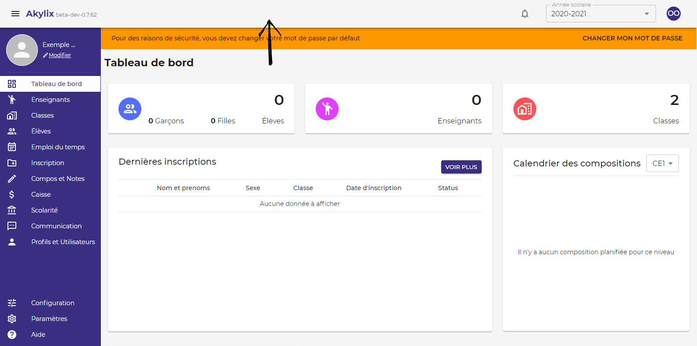

### Menu de navigation

Le menu de navigation, qui est en bleue et se trouve à gauche de votre écran, il va vous permettre de naviguer entre les différents modules (sections) qu’offre Akylix

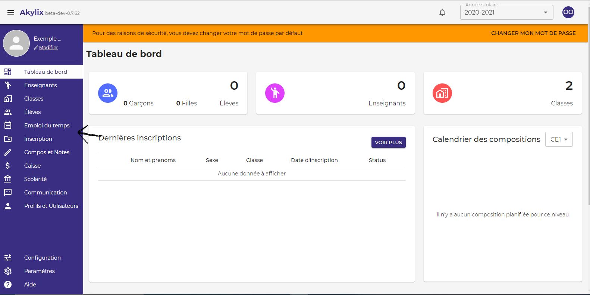

### Zone de travail

La zone de travail est la partie située au milieu de votre écran, elle va vous permettre de voir les informations sur un module sélectionné, et d’effectuer les actions sur ce module tel qu’afficher, ajouter, modifier, supprimer...

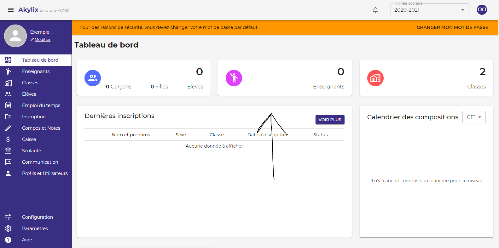

---

## Superviseur

Le superviseur est celui qui gère un ou plusieurs établissements scolaires et en a une vue Globale.

Pour dérouler le menu de navigation à gauche de votre écran, cliquez sur les trois traits dans la bare de navigation à côté d'Akylix en haut à gauche de votre écran.

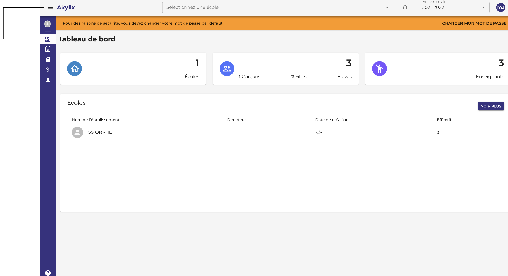

---

## Création d’année scolaire

Pour définir les années scolaires cliquez sur **Mes années scolaires** dans le menu de navigation

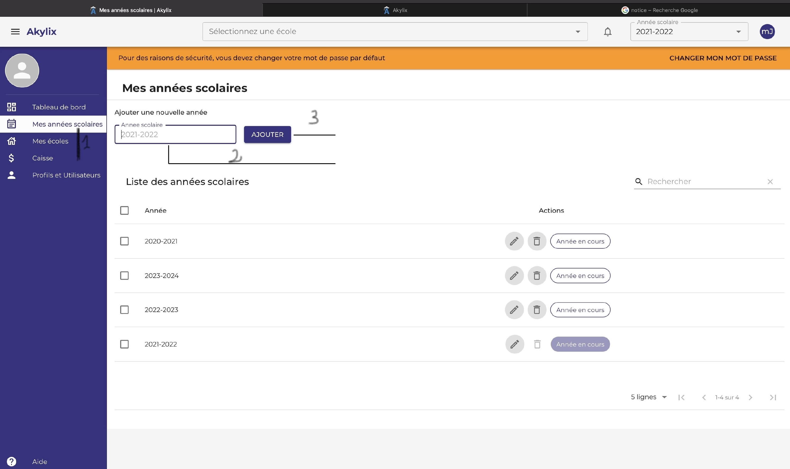

Cliquez sur la zone **Année scolaires** dans la zone de travail et saisissez l'année sous le format suivant **2020-2021** puis cliquez sur le bouton **Ajouter**

## Profils et utilisateurs

Pour définir les Profils et utilisateurs cliquez sur **Profils et utilisateurs** dans le menu de navigation puis sélectionnez votre école grâce à l'onglet **Sélectionner une école** dans la zone de travail.

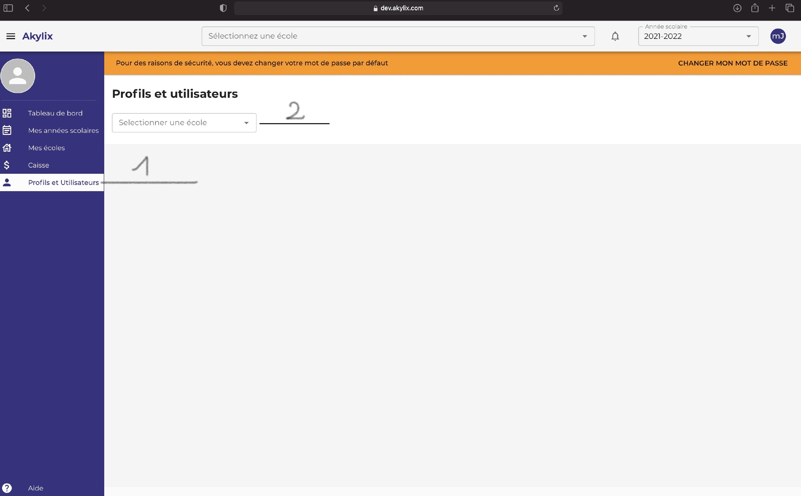

Ensuite cliquez sur **Utilisateurs**

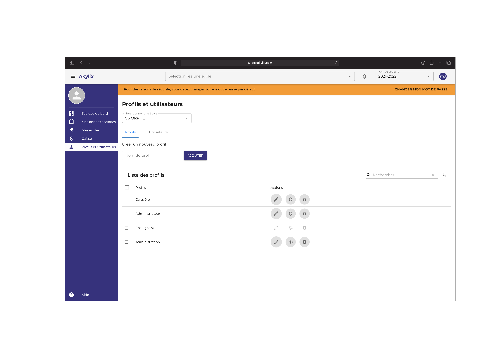

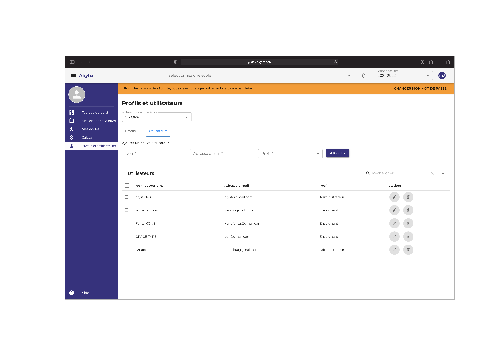

Une fois ici vous allez renseigner le **Nom**, l'**Adresse e-mail** et pour le profil sélectionnez **Administrateur** ensuite cliquez sur le bouton **Ajouter**

:::note

L'adresse e-mail fournit ici sera l'identifiant de l'Administrateur, veuillez utiliser une adresse différente de celle du superviseur.

:::

## Déconnection
Pour vous déconnectez cliquez dans les initiales en haut à droite dans le cercle bleu et cliquez sur **Se déconnecter**

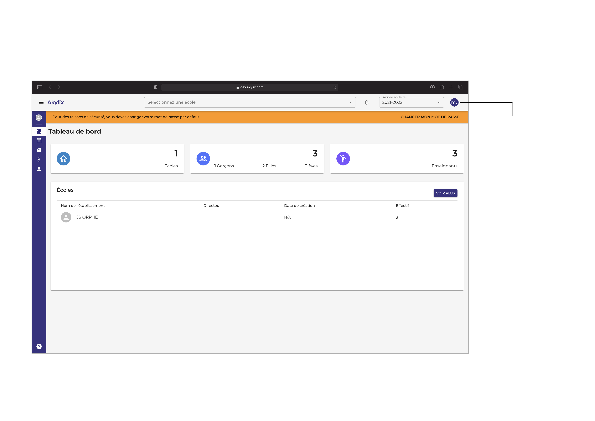

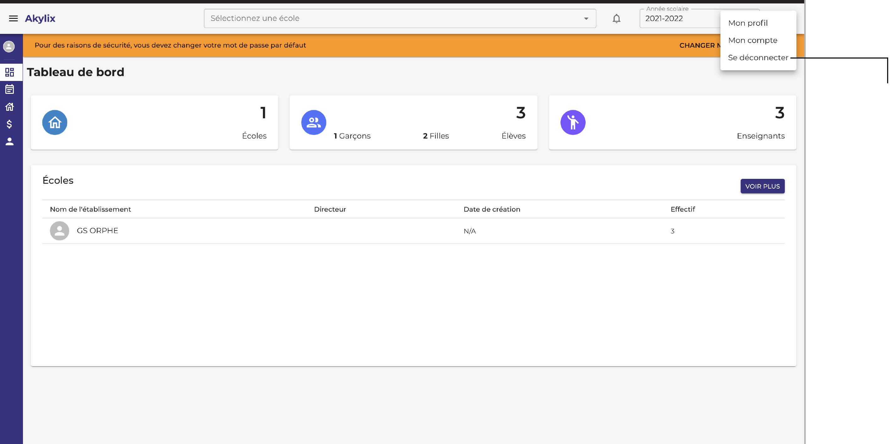

---