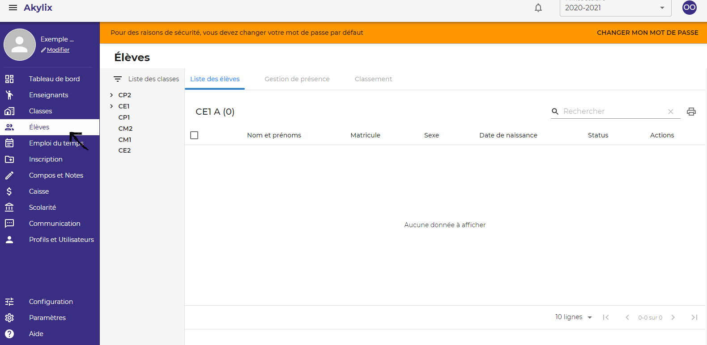
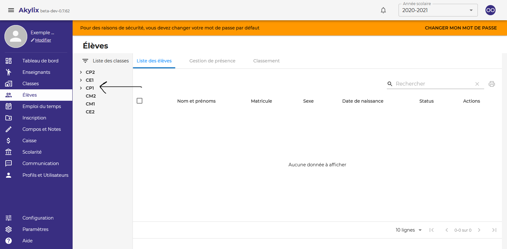
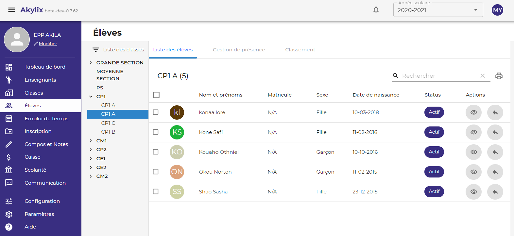
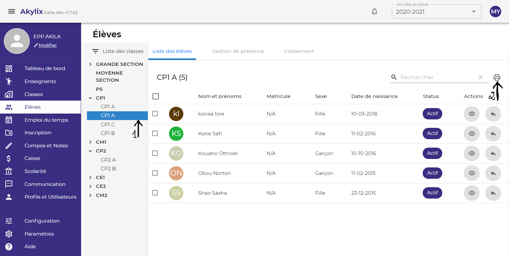
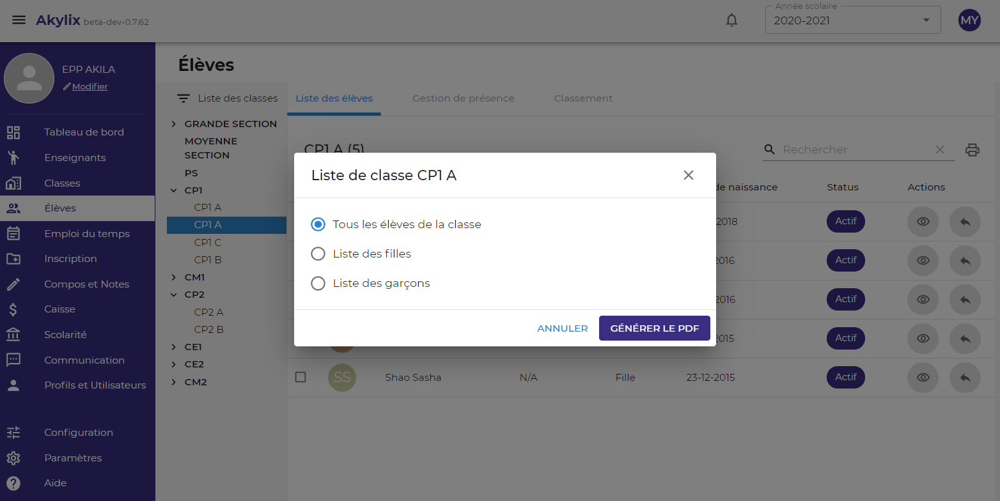
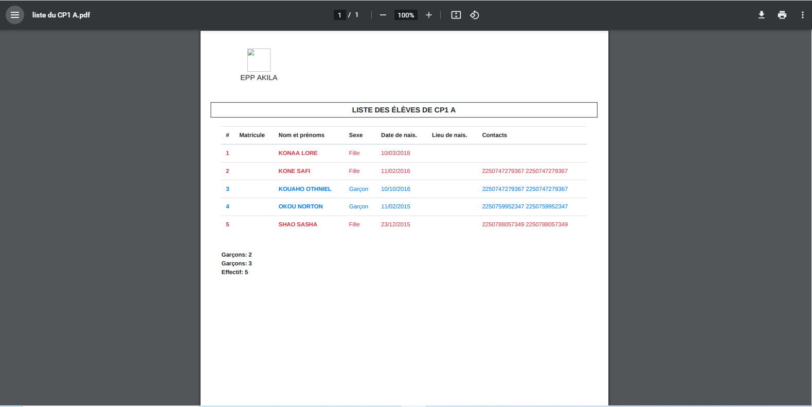

## Élèves

Il s’agit de voir la liste de tous les élèves de votre établissement, et de pouvoir faire des actions sur les élèves tel qu’imprimer la liste des élèves d’une classe, transférer un élève etc.

Sur le menu latéral bleu à gauche de votre ecran cliquez sur **Elèves**

Vous pouvez sélectionnez une classe, la liste des élèves de cette classe va s’afficher si elle contient des élèves.

Vous pouvez filtrer la liste par niveau et par classe, et ainsi pour chaque élève avoir ses informations.

Vous pouvez accéder au dossier scolaire de l'élève en cliquant sur **l’icône de l’œil** dans la partie **Actions** dans la zone de travail.

Vous pouvez transférer l’élève dans une autre classe en cliquant sur **l’icône de la flèche** juste après **l’icône de l’œil** dans la partie **Actions**.

### Impression liste élèves

Vous pouvez imprimer la liste des élèves d’une classe.

Pour cela veillez sélectionner la classe que vous voulez imprimer (voir flèche 1), la liste des élèves de la classe sélectionner va s’afficher, ensuite cliquez sur l’icone d’impression (voir flèche 2).

Une boite de dialogue va s’afficher vous demandant de choisir entre ***Tous les élèves de la classe***, la ***Liste des filles*** ou la ***Liste des garçons***, ensuite cliquez sur le bouton **GENERER LE PDF**

La liste des élèves sera générée vous pouvez aller dans votre dossier de téléchargement et voir la liste des élèves sous le format PDF portant le nom de la classe.

vous pouvez l'ouvrir pour voir la liste des élèves

