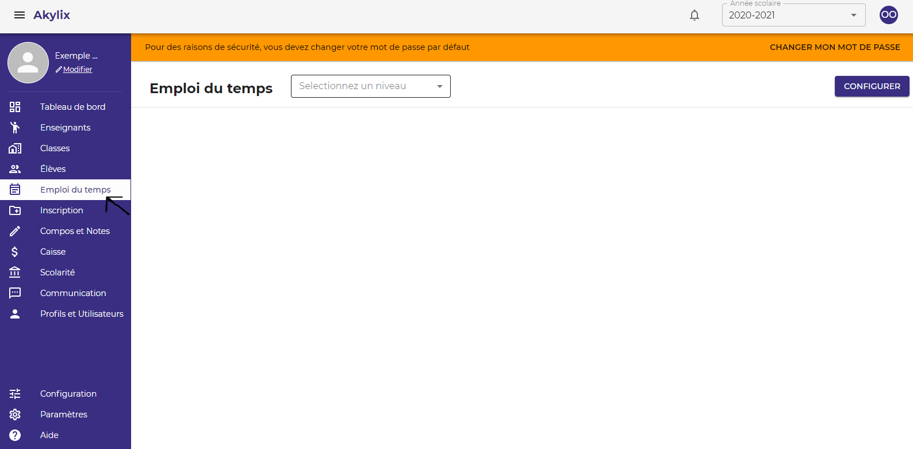
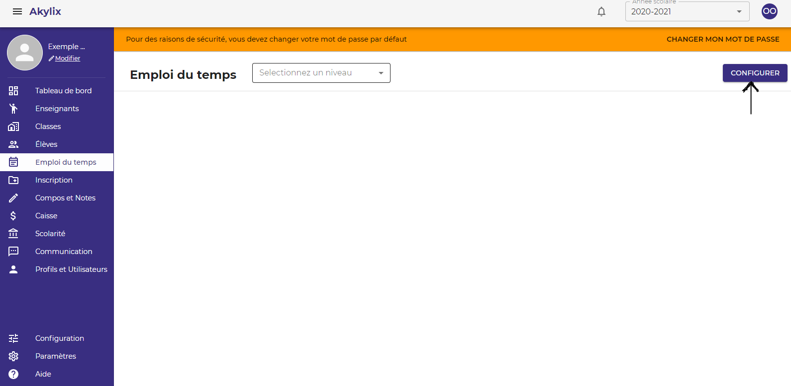
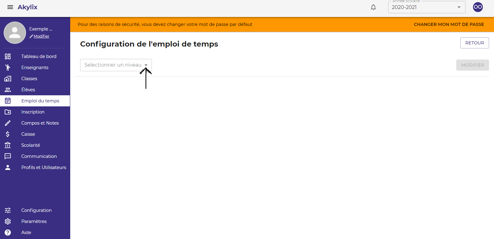
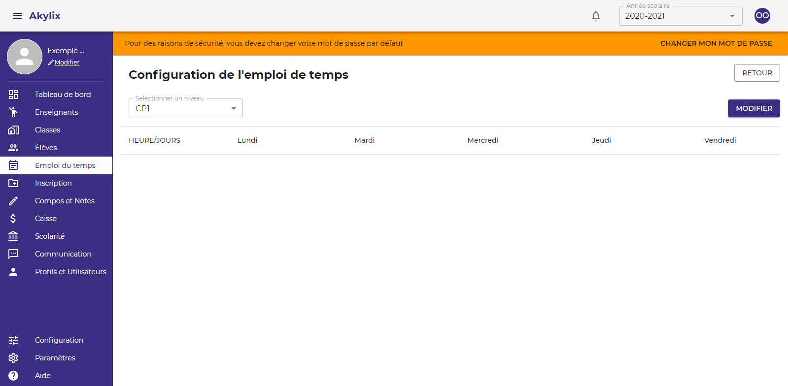
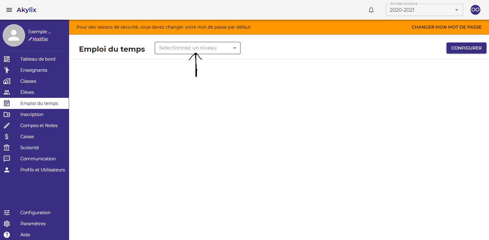

## Emploi du temps

Dans cette partie, vous devez créer les emplois du temps pour chaque niveau.

Pour cela cliquez sur **Emploi du temps** dans le Menu latéral bleu à gauche de votre ecran

Pour définir l'emploi du temps cliquez sur le bouton **Configurer** dans la zone de travail en haut à droite

Sélectionnez un niveau en cliquant sur **Sélectionner un niveau**

Et pour le niveau sélectionné, renseignez les matières de l’emploi du temps

Cliquez sur **Modifier** pour mettre à jour l’emploi du temps.

Cliquez sur **Retour** pour accéder à la première page.

Sur la première page, vous pouvez sélectionner un niveau dans le champ **sélectionner un niveau** et afficher l’emploi du temps du niveau sélectionné  (vous pouvez le modifier)

