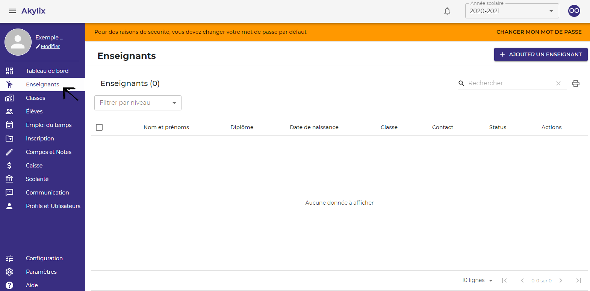
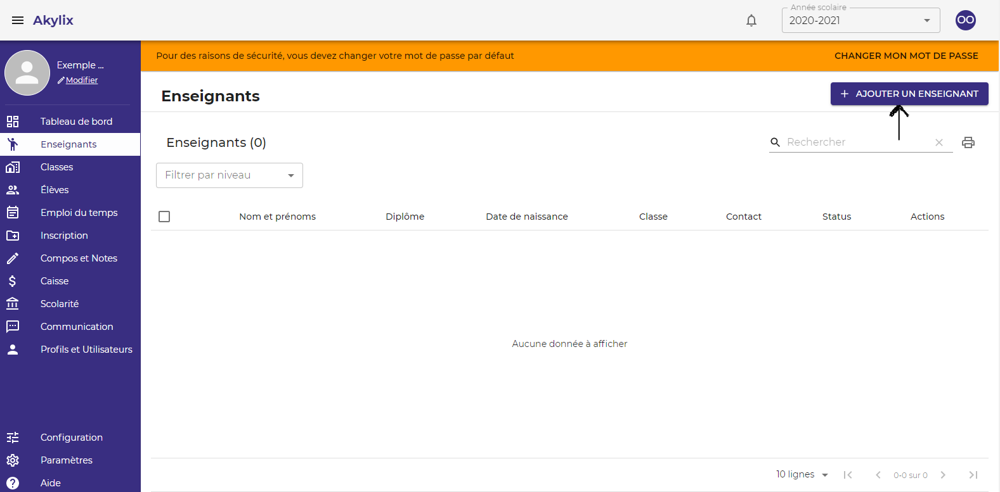
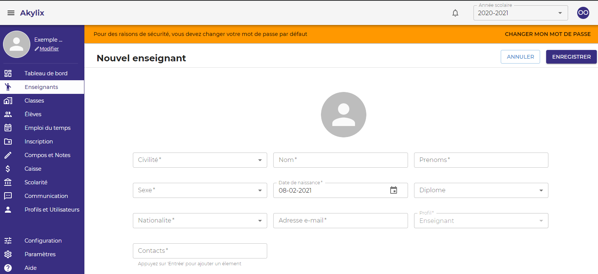

## Enseignants

Cette partie consiste à créer les profils de tous les enseignants de votre établissement.

Pour ce faire cliquez sur **Enseignants** dans le Menu latéral à gauche de votre ecran

Ensuite cliquez sur le bouton **AJOUTER UN ENSEIGNAT** dans la zone de travail

Puis renseignez les informations de l'enseignant

**Les champs avec un astérix (*) sont des tous obligatoires**

Apres avoir fini de renseigner toutes les informations cliquez sur le bouton **Enregistrer**

