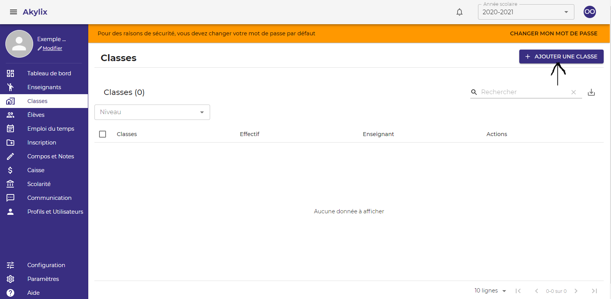
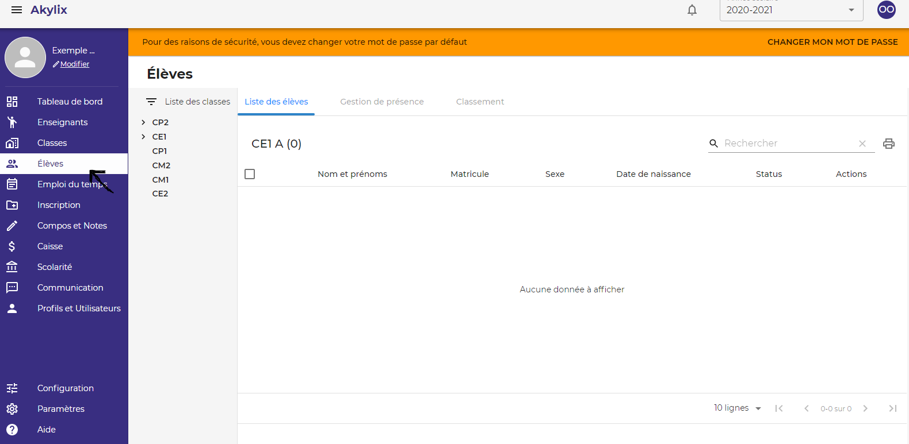
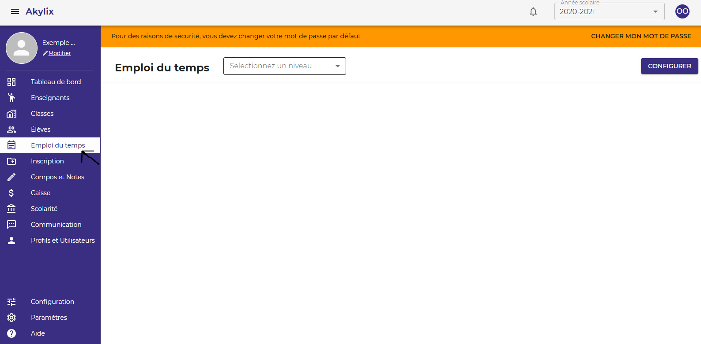
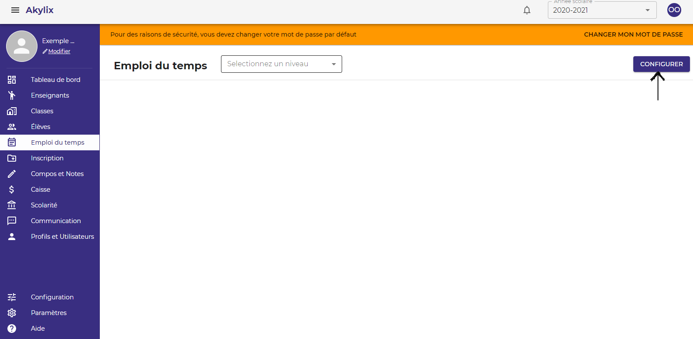
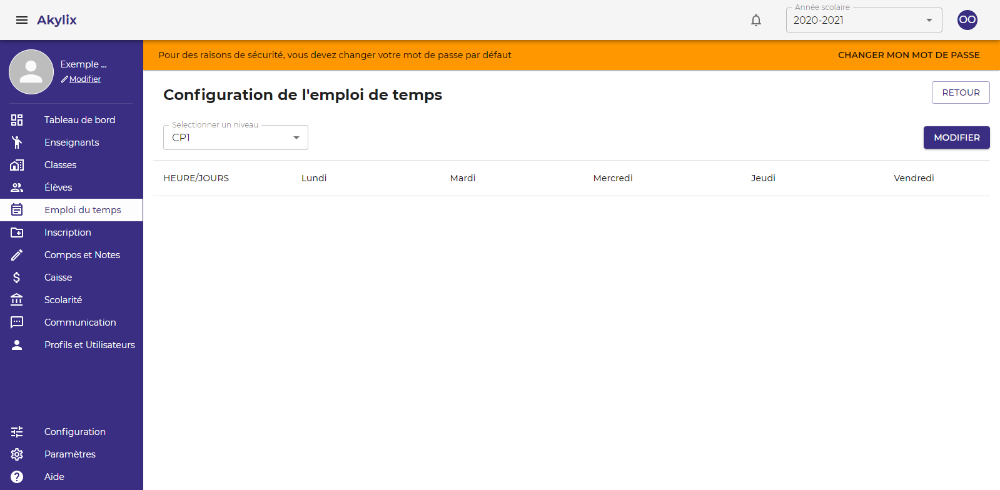
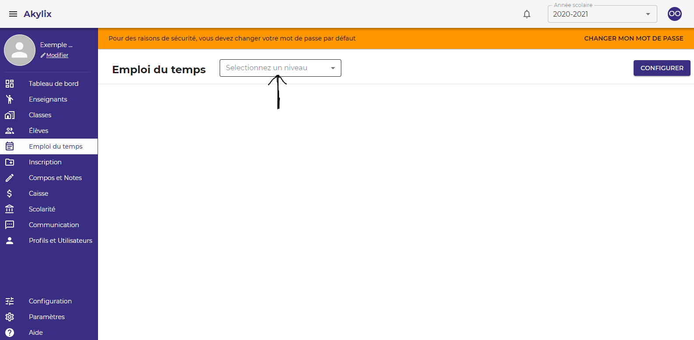
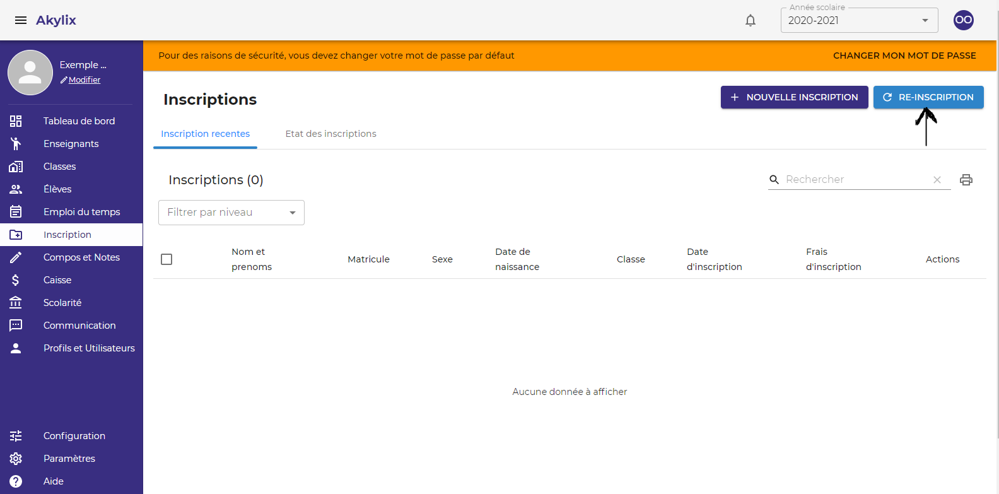
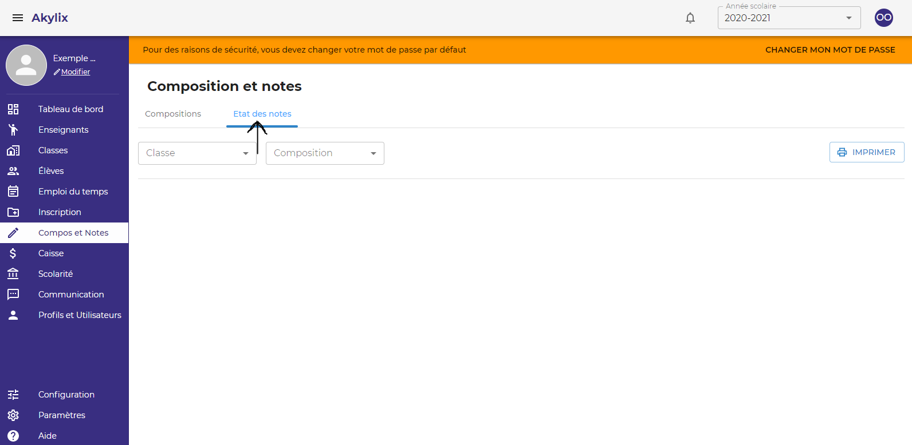
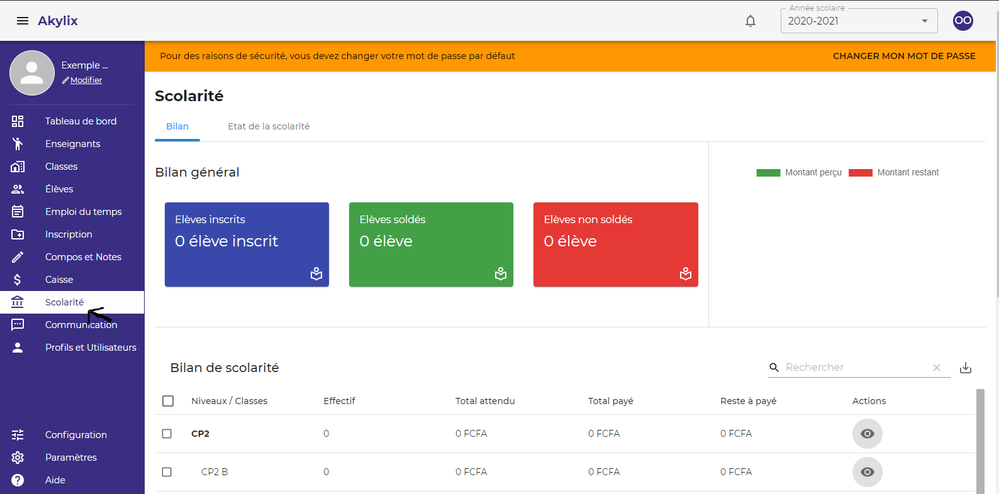
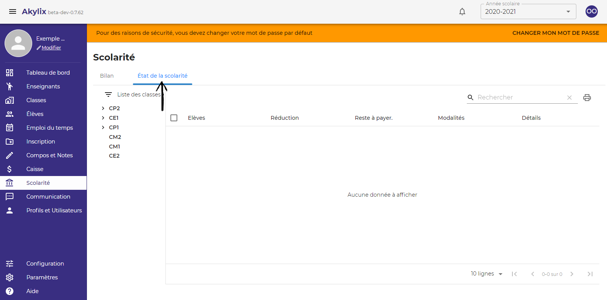

## Enseignants

Cette partie consiste à créer les profils de tous les enseignants de votre établissement  
Pour ce faire cliquez sur **Enseignants** sur le menu bleu à gauche de votre ecran

Ensuite cliquez sur le bouton **AJOUTER UN ENSEIGNAT**

Puis renseignez les informations de l'enseignant 
**Les champs avec un Astérix (*) sont des champs obligatoires**  
Apres avoir fini de renseigner toutes les informations cliquez sur le bouton **Enregistrer**

## Classes

Il s’agit ici de créer des classes et de les attribuer un enseignant qu’on a préalablement crée dans la partie ***Enseignant***.  
Pour cela cliquez sur **Classes** dans le menu bleu à gauche

Cliquez sur le bouton **Ajouter une classe**

Sélectionnez un niveau, en cliquaant sur **Niveau**
Ecririvez le nom de la classe dans l'onglet **Nom de la classe**
Ajoutez un enseignant en cliquant sur l'onglet **Enseignat** , ***Cette action est facultative***  
Ensuite Cliquez sur **valider**  
Et répétez l’action jusqu’à créer toutes les classes pour votre  école

## Élève

Il s’agit de la liste de tous les élèves de votre établissement.  
sur le menu bleue à gauche de votre ecran cliquez sur **Elève**

Vous pouvez filtrer la liste par niveau et par classe. Et ainsi pour chaque élève avoir ses informations.
Vous pouvez accéder au dossier scolaire en cliquant sur **l’icône de l’œil** dans la partie **Action**.
Vous pouvez transférer l’élève dans une autre classe en cliquant sur **la flèche** juste après **l’œil**.

## Emploi du temps

Dans cette partie, vous devez créer les emplois du temps pour chaque partie

Pour définir l'emploi du temps cliquez sur le bouton **Configurer** en haut à droite

Sélectionnez un niveau en cliquant sur **Sélectionner un niveau**

Et pour le niveau sélectionné, renseignez les matières de l’emploi du temps

Cliquez sur **Modifier** pour mettre à jour l’emploi du temps. 
Cliquez sur **Retour** pour accéder à la première page.

Sur la première page, vous pouvez sélectionner un niveau dans le champ **sélectionner un niveau** et afficher l’emploi du temps (vous pouvez le modifier)

## Inscription

Ce module comprend la partie **INSCRIPTION** et la partie **REINSCRIPTION**.

La partie **INSCRIPTION** concerne les nouveaux élèves et la partie **REINSCRIPTION** pour les anciens élèves.

### Inscription

Pour inscrir un nouveau élève Cliquez sur **Nouvelle inscription** en haut à droite

Renseigner les informations **seule les champs comportant un Astérix (*)** sont obligatoires. Les autres informations peuvent être renseignée plus tard. 
Vous pouvez ajouter une photo  
Une fois que vous avez fini de renseigner les informations cliquez sur le bouton **Enregistrer**.

### Réinscription

**(Nous y reviendrons)**

## Compositions et notes

### Compositions

Ici il s'agit de définir les compositions

Sélectionner un niveau en cliquant dans l'onglet **Niveau**
Renseignez le nom de la composition dans **Nom de la composition** puis la date de tenue dans **Date** ensuite
Cliquez sur le bouton **Ajouter**

Vous pouvez filtrer les compositions par niveau en cliquant sur **Filtrer par Niveau** : les modifier en cliquant sur l'icône du **crayon** ou les supprimer en cliquant sur l'icône de **la corbeille**.

### Etat de note

Pour accéder à l’état des notes cliquez sur **Etat des Notes**

Sélectionner une classe en cliquant sur **Classe**
Puis la composition pour laquelle vous voulez avoir les états en cliquant sur **Composition**.   
Vous pouvez générer les états sous forme de documents PDF afin de les imprimer en cliquant sur **IMPRIMER** en haut à droite

## Caisse

### Opération

Cette partie ne concerne que les opérations d’entrée en caisse.

### Etat de la caisse

Il s’agit ici de vérifier les actions effectuées à la caisse et de clôturer la journée lorsqu’on a fini de travailler.
Vous pouvez également effectuer un suivi de caisse en sélectionnant le caissier pour lequel vous voulez effectuer le suivi

## Scolarité

### Etat de la scolarité

C’est la partie où vous pouvez voir le bilan des versements de scolarité à travers des statistiques générales

## Communication

