## Inscription

Ce module comprend la partie **INSCRIPTION** et **REINSCRIPTION**.

La partie **INSCRIPTION** concerne les nouveaux élèves et la partie **REINSCRIPTION** pour les anciens élèves.

Pour inscrire un nouvel élève allez sur **Inscription** dans le menu de navigation en bleu à gauche de votre ecran.

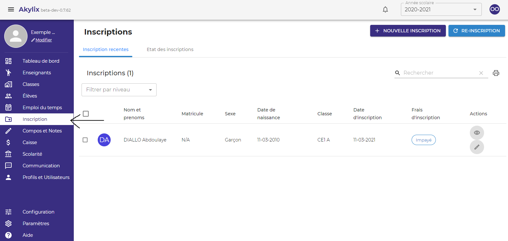

### Inscription

Pour inscrire un nouvel élève cliquez sur **Nouvelle inscription** dans la zone de travail en haut à droite

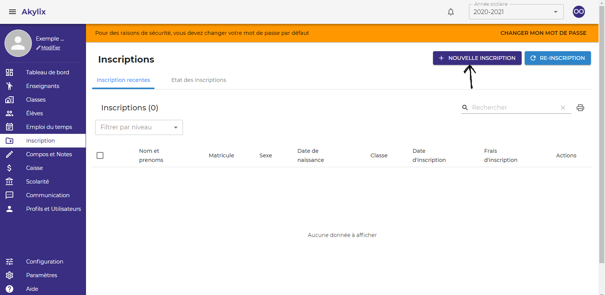

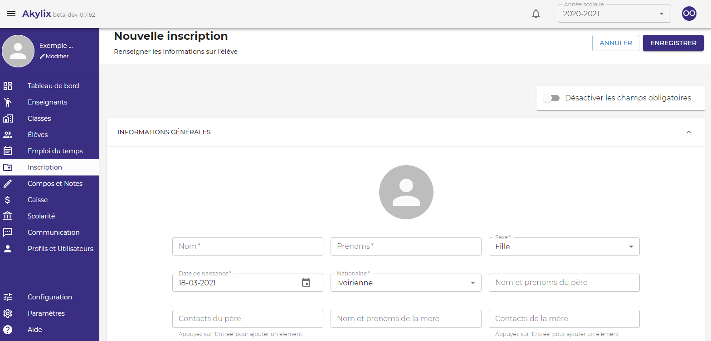

Une fois sur cette page renseignez les informations de l'élève, **seule les champs comportant un astérix (*)** sont obligatoires. Les autres informations peuvent être renseignée plus tard.

Vous pouvez ajouter une photo 

Une fois que vous avez fini de renseigner les informations cliquez sur le bouton **Enregistrer**.

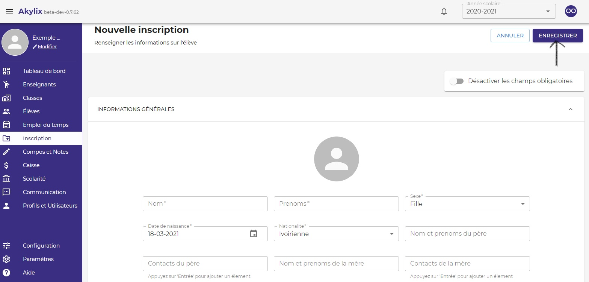

Une fois que vous avez enregistrer un élève une alerte va s’afficher vous demandant de TELECHARGER LE RECU.

Veuillez cliquer sur **TELECHARGER LE RECU**.

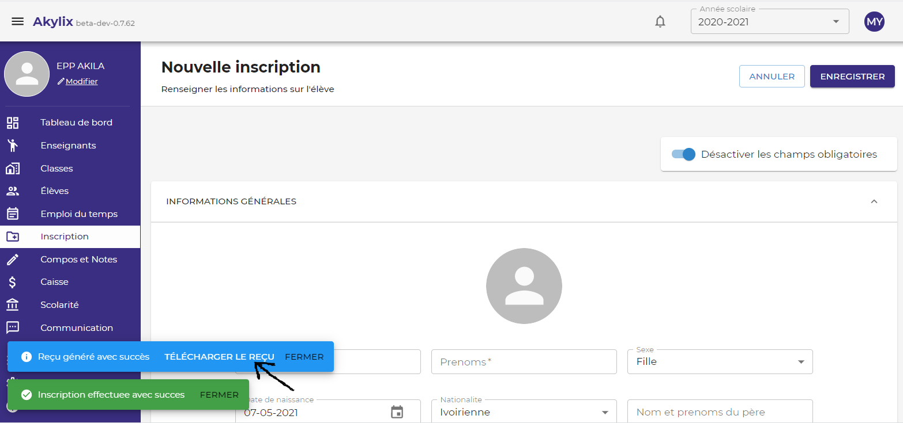

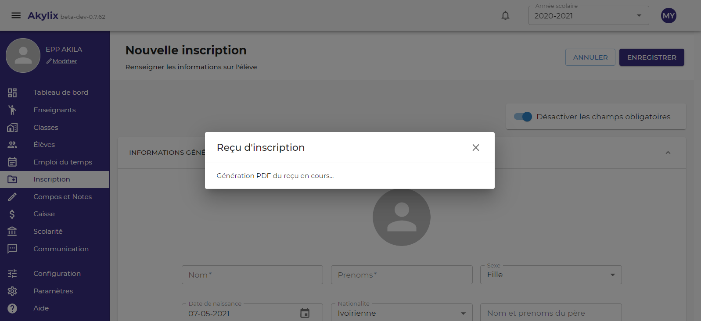

Apres quelques secondes le reçu sera générer et accessible dans votre dossier de téléchargement.

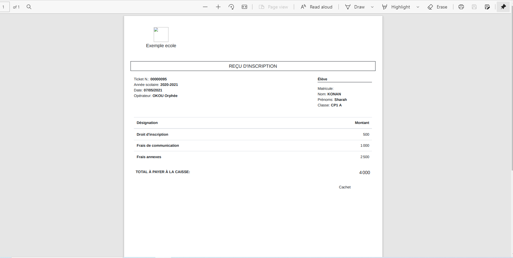

:::note

le bouton **Désactiver les champs obligatoires** permet de désactiver les champs obligatoires lors de l'inscription d'un élève, mais il est recommandé de renseigner autant d'information possible.

:::

### Impression liste élèves

Vous pouvez imprimer la liste des élèves déjà inscrit.

Pour cela cliquez sur l'icône d'impression dans la zone de travail

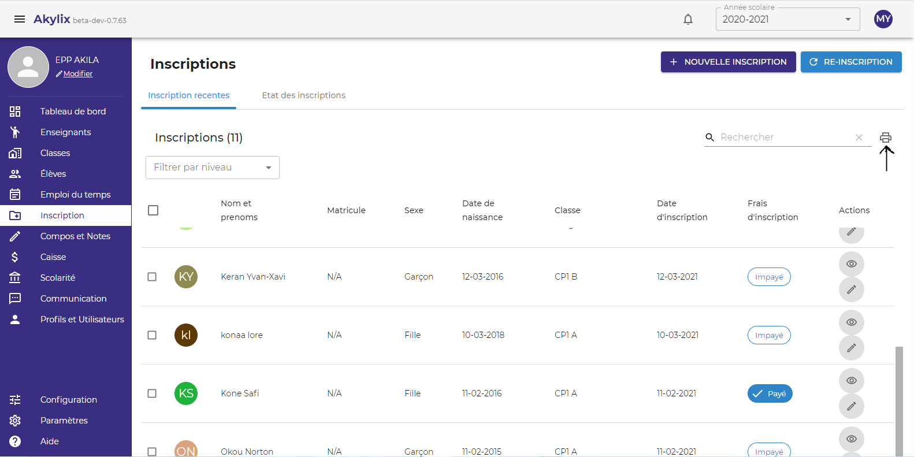

Lorsque vous cliquez sur l'icône d'impression une boite de dialogue s'affiche vous demandant de choisir le niveau que vous voulez imprimer.

Choisissez le niveau en cliquant sur le champ Niveau et définissez l'intervalle de temps que vous voulez en choisissant une date de début et une date de fin.

Ensuite cliquez sur le bouton **GENERE LE PDF**

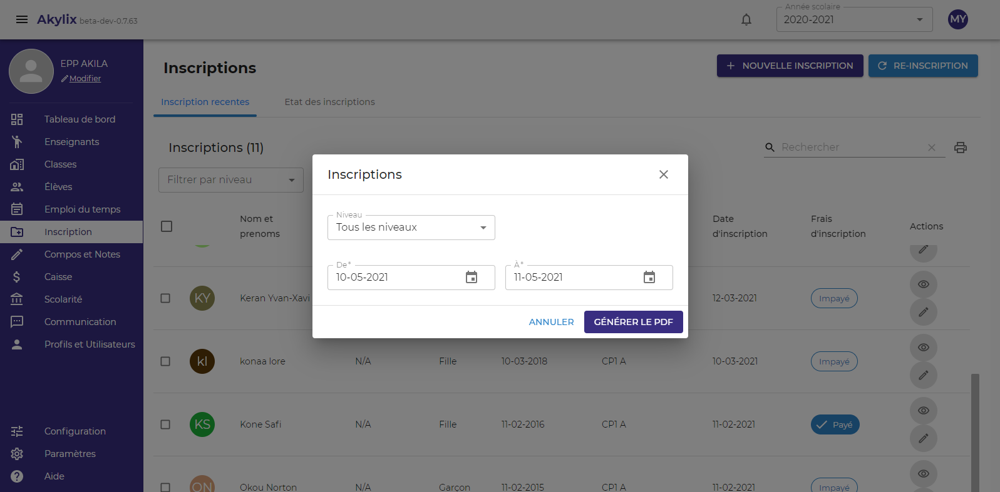

Apres avoir cliquez sur le bouton **GENERE LE PDF**, un fichier PDF sera généré et accessible dans votre dossier de téléchargement.

### Etat des inscriptions

Il s'agit ici de voir l'etat des inscriptions

Vous pouvez aussi importer l'état des inscriptions.

Pour ce faire sélectionner le niveau dans le menu latéral

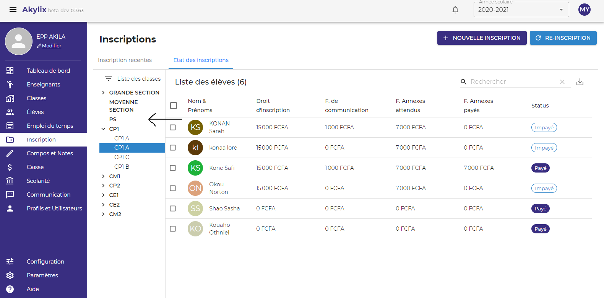

Ensuite cliquez sur la flèche d'importation dans la zone de travail.

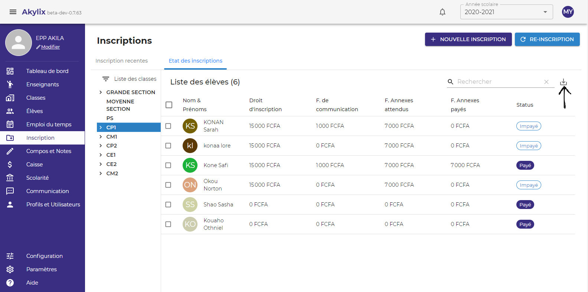

Apres avoir cliquez sur la flèche, un fichier sera généré et accessible dans votre dossier de téléchargement.

## Réinscription

**(Nous y reviendrons)**