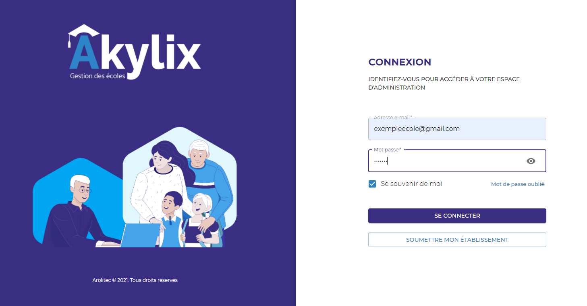
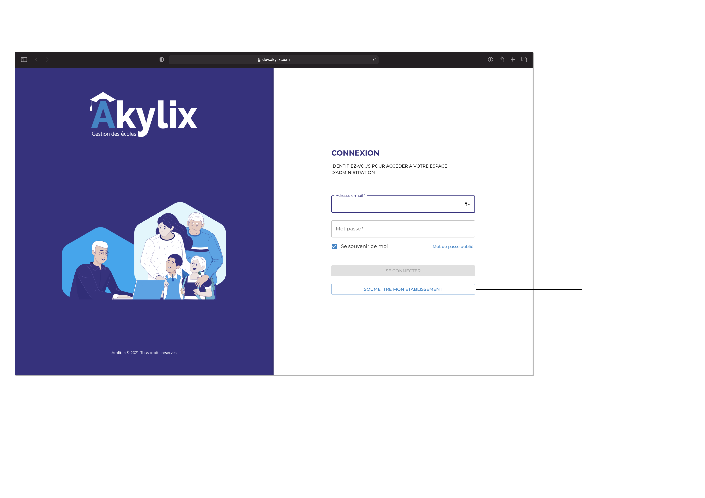
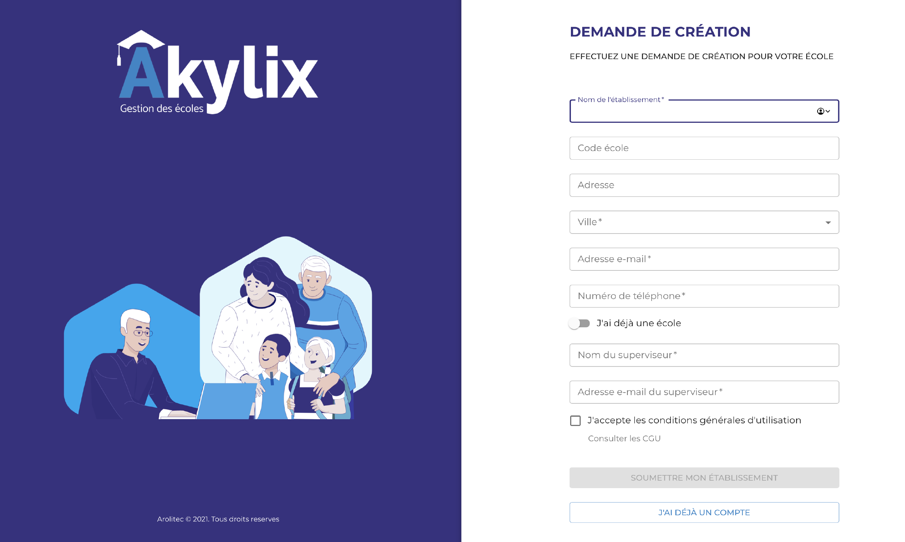
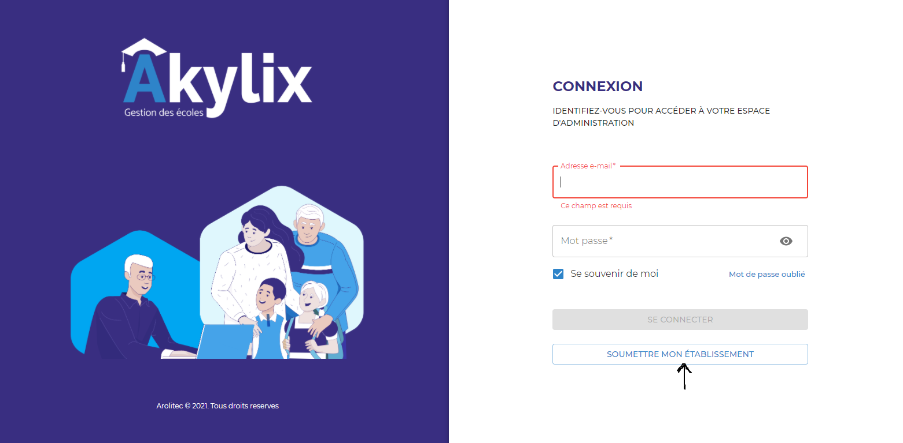

## A propos

Bienvenue sur la documentation officielle d'Akylix la Plateforme de gestion des écoles.

Akylix est une application web et mobile conçue pour optimiser la gestion des établissements scolaires et la communication par SMS avec les parents d'élèves.

:::note

Disposez d'une adresse e-mail pour l'établissement

D’une adresse e-mail pour les profils que vous aurez à créer

Utilisez différentes adresses e-mails si vous êtes à la fois superviseur, administrateur et enseignant

:::

---

## Comment l'utliser?

La présente documentation s'adresse à toute personne désirant utiliser une application web et mobile pour optimiser la gestion de son établissement scolaires et la communication par SMS avec les parents d'élèves.

### Accès à la plateforme 

Pour accéder à Akylix cliquez sur [Akylix](https://app.akylix.com/).

Ou saisissez l'url suivante :

> https://app.akylix.com/

### version test
 
Pour ceux qui veulent faire des tests veuillez utiliser le lien suivant:

Pour accéder à Akylix cliquez sur [Akylix Dev](https://dev.akylix.com/).

Ou saisissez l'url suivante :

> https://dev.akylix.com/

### Page d'Accueil

---

## Soummettre son établissement

Une fois sur Akylix vous devez soumettre votre établissement.

:::warning

La soumission d'établissement se fait une seule fois par établissement

:::

Pour soumettre votre établissement cliquez sur **SOUMETTRE MON ETABLISSEMENT** et renseignez toutes les informations.  
Cliquez dans la case **J'accepte les conditions générales d'utilisation** 
Ensuite cliquez sur le bouton **SOUMETTRE MON ETABLISSEMENT**

:::note

Tous les champs comportant un Astérix (*) sont obligatoires 
Les adresses e-mails s’écrivent en minuscule 
Précédez de 225 les contacts téléphoniques et n’y ajoutez aucun espace

:::

<!--  -->

:::note

Vous recevrez un message vous notifiant la prise en compte de votre enregistrement et son traitement
Vérifiez votre messagerie mail pour y retrouvez les identifiants de connexion.

:::

---