## Parametrages

:::important

La première chose à faire est de paramétrer l’application (Les informations des paramètres sont des informations qui ne changent pas forcement chaque année)

:::

Dans le Menu latéral à gauche, cliquez sur **Paramètres**, l'avant dernier module

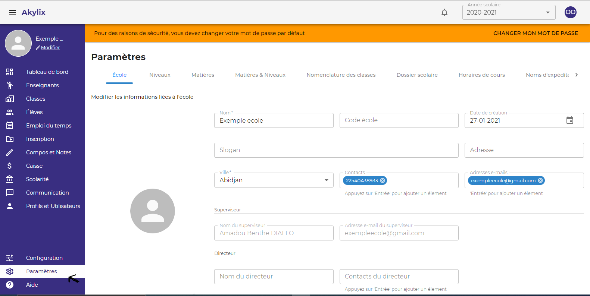

### Les informations sur l'école

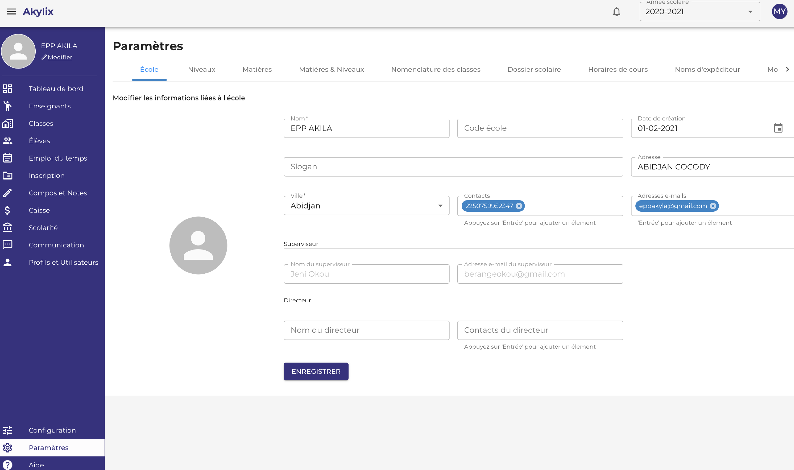

La première tâche est la finalisation des informations sur l’école.

Lorsque cela est terminé, cliquez sur le bouton **Enregistrer**

### Les Niveaux

Pour aller sur l'onglet niveau cliquez sur **Niveau** dans la zone de travail

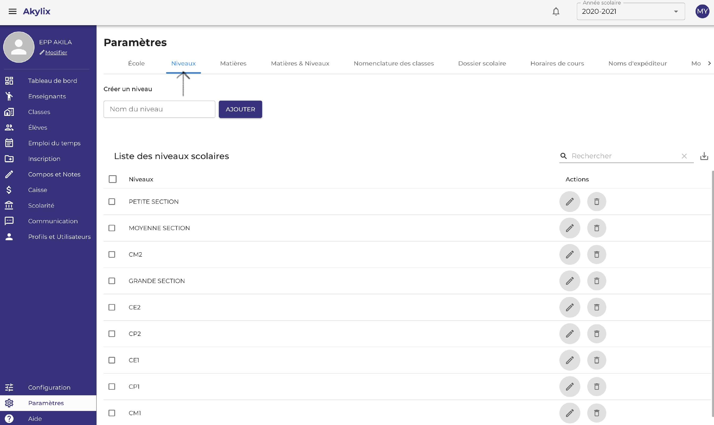

Les niveaux du primaire par défaut sont déjà définis et affichés : 

Pour modifier cliquez sur l’icône du **crayon** en face du niveau

Pour supprimer cliquez sur l’icône de la **corbeille** 

Pour ajouter des niveaux : écrivez le nom du niveau dans le champ **Nom du Niveau** dans la zone de traval puis cliquez sur **Ajouter**

### Matière

IL S’AGIT ICI DE CRÉER UNE LISTE DE TOUTES LES MATIERES ENSEIGNEES DANS VOTRE ECOLE.

Pour ce faire cliquez sur l'onglet **Matière** dans la zone de travail

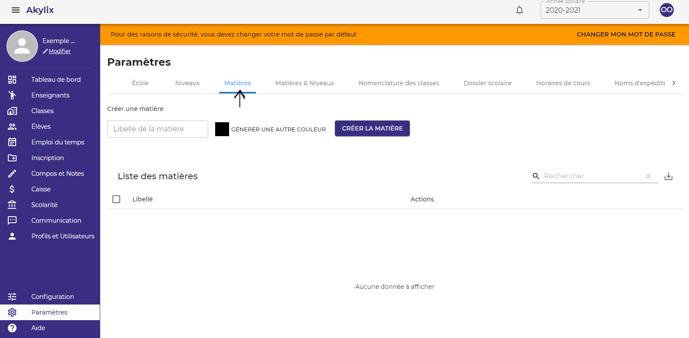

Ecrivez le nom de la matière dans le champ **libelle de la matière**

Générez une couleur à attribuer à la matière en cliquant sur le champ **générer une couleur**

Cliquez ensuite sur le bouton **CREER LA MATIERE** pour l’ajouter

Répétez l’action jusqu’à créez toutes les matières enseignées dans votre établissement.

### Matières et Niveaux

Pour aller sur l'onglet matières et niveaux cliquez sur **Matières et Niveaux** dans la zone de travail

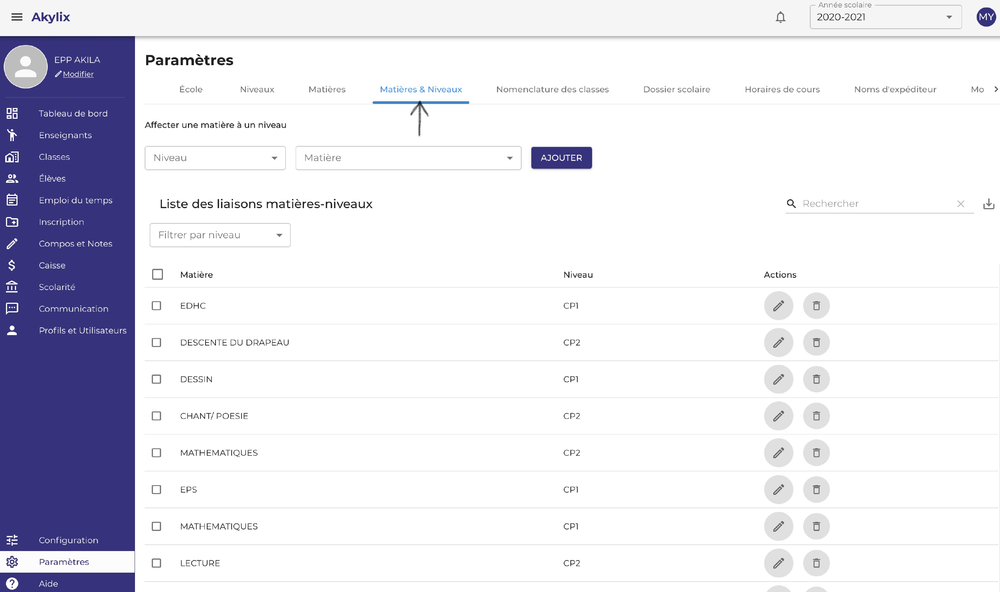

Il s’agit ici de lier les matières créer au préalable aux niveaux également créer, c’est une liaison entre la matière enseignée et le niveau.

Toujoure dans la zone de travail cliquez dans le champ **Niveau** et sélectionnez un niveau *CP1 par Example*.

Cliquez dans le champ **Matière** sélectionnez une matière, ou cliquez sur toutes les matières que vous voulez lier au niveau que vous avez choisi

Cliquer sur **Ajouter**.

Répétez l’action jusqu’à lier des matières à tout les niveaux que vous avez créé.

### Dossiers Scolaire

Pour aller sur l'onglet Dossiers Scolaire cliquez sur **Dossiers Scolaire** dans la zone de travail

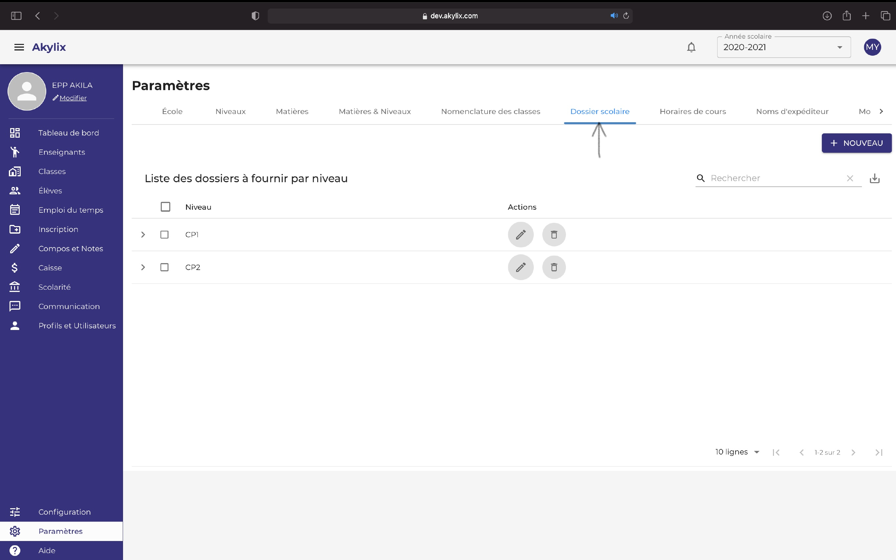

Toujours dans la zone de travail cliquez sur le bouton **NOUVEAU** en haut à droite

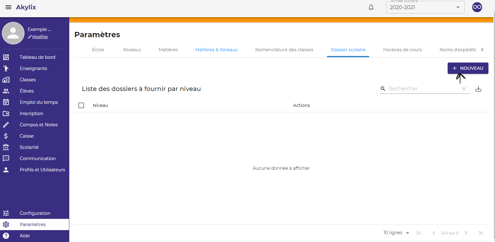

Ensuite cliquez sur **Selectionner un Niveau** pour selectionner le niveau.

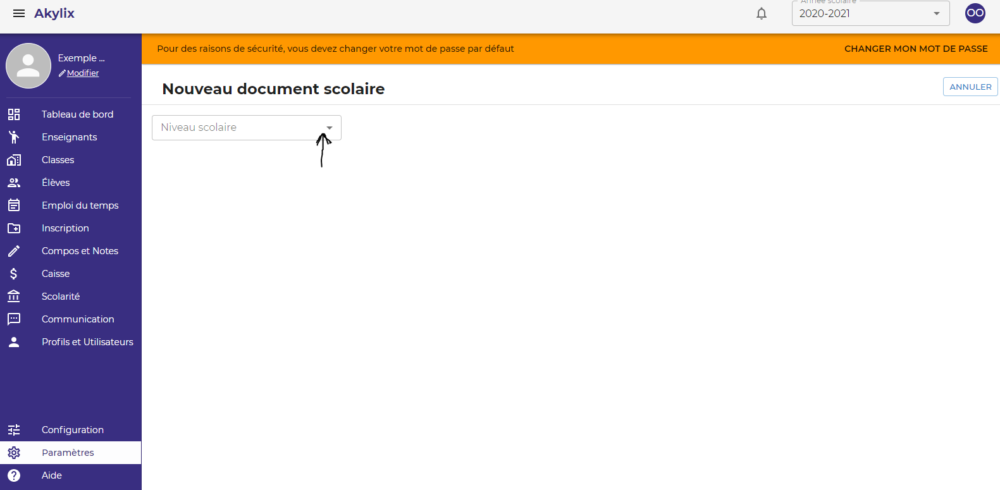

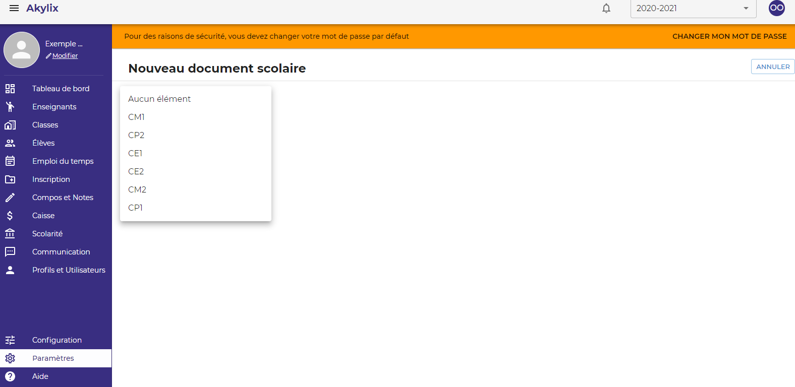

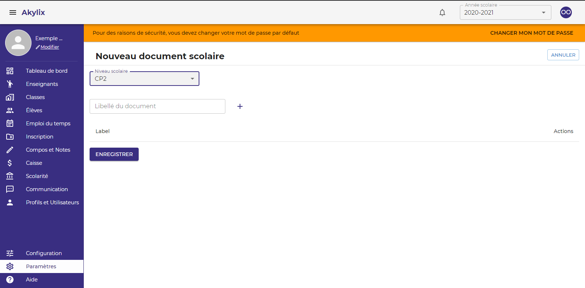

Ensuite ecrivez l’intitulé du dossier dans le champ **Libelle du Document**

Puis cliquez sur le bouton (**+**) juste à côté le champ **Libelle du Document**.

Après avoir fini de renseigner tous les dossiers cliquez sur le bouton **ENREGISTRER**

Et faites ceci pour tout les Niveaux.

### Horaire de Cours

**Il s’agit de créer des horaires de cours pour l’emploi du temps.**
:::note

UTILISER LA PLUS PETITE UNITE HORAIRE POUR FACILITER LA CREATION

:::

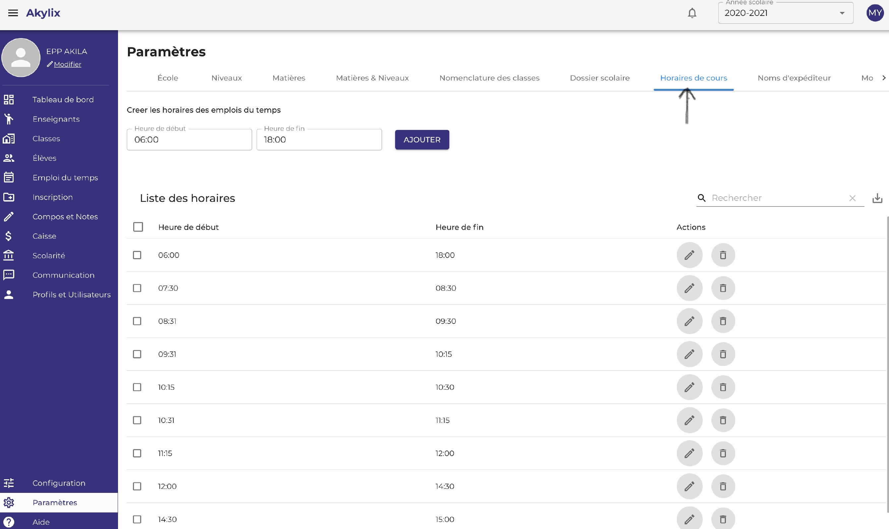

Renseignez une heure de début dans la zone **Heure de début** et une heure de fin dans la zone **Heure de fin**

**Ex : 7h 30 - 8h 15**

Cliquez sur **Ajouter** et répétez jusqu’à la fin.

### Nom d’expéditeur

**Nom d’expéditeur** .

**Ex : EPP ORPHEE**

:::warning

Le nom d’expéditeur doit être constitué de 11 caractères donc vous pouvez abréger le nom de votre école s’il est long.

:::

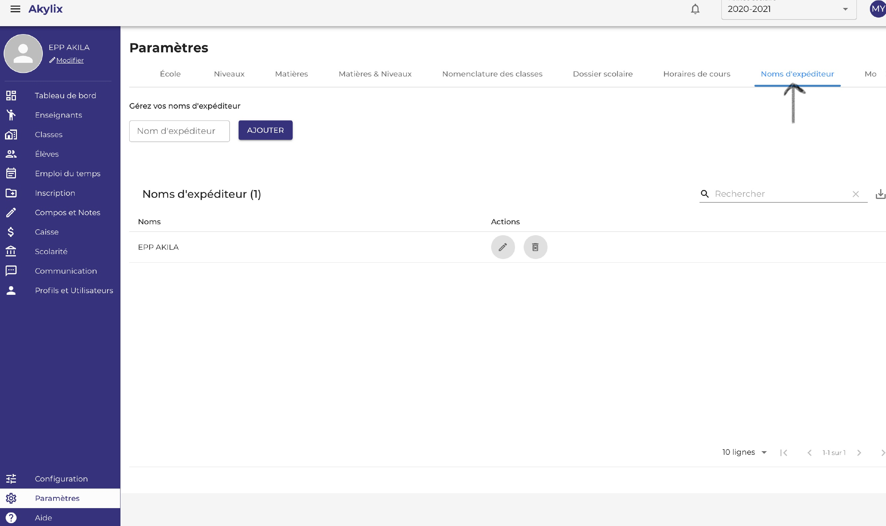

Dans le champs **Nom d'expediteur**  renseignez le nom d'xpediteur **Ex : EPP ORPHEE** 

Ensuite cliquez sur le bouton **Ajouter**

### Modèle de message

Il s’agit de préenregistrer des modèles de messages.

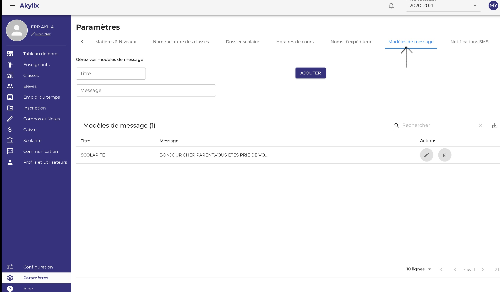

Dans le champ **Titre** écrivez le titre du message

**Ex : Mardi Gras**

Dans le champ **Message** écrivez le contenu du message ensuite cliquez sur le bouton **Ajouter**

### Notifications SMS

Il s’agit de choisir un nom d’expéditeur pour l'envoie des SMS

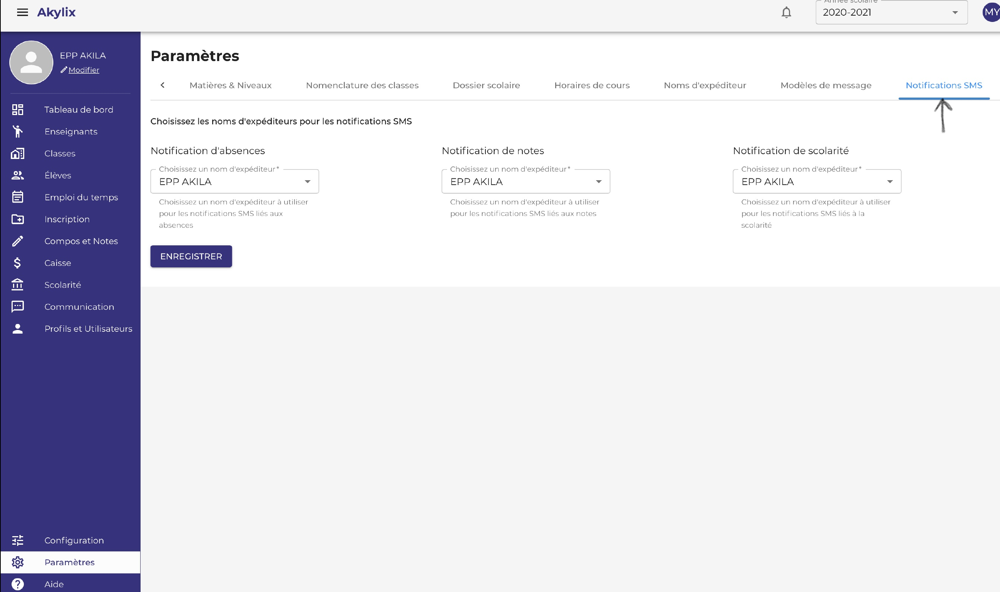

Pour ce faire cliquez dans l'onglet **Choisissez un nom d’expéditeur** pour les envois des différentes notifications d’informations aux parents à savoir et cliquez sur le bouton **Enregistrer**

